# MRS for SAS Users

**R** is a very popular programming language with a rich set of features and packages that make it ideally suited for data analysis and modeling. 
Traditionally, R works by loading, i.e copying, everything (including data sets) as objects in the memory.  This means that large data sets can quickly surpass the amount of memory needed to load them into an R session. Over time, many R packages have been introduced that attempt to overcome this limitation.  Some packages propose a way to more efficiently load and process the data, which would in turn allow us to work with larger data sizes.  This approach however can only take us so far, since efficiency eventually hits a wall.  Microsoft R Server (MSR) on the other hand takes a different approach.  MRS's **RevoScaleR** package stores the dataset on the disk (hard drive) and loads it only a **chunks** at a time (where each chunk is a certain number of rows) for processsing.  When the processing is done, it then moves to the next chunk of the data. By default, the **chunk size** is set to 500K rows, but we can change it to a lower number when dealing with *wider* datasets (lots of columns), and a larger number when dealing with *longer* data sets (few columns).  In other words, data in RevoScaleR is *external* (because it's stored on disk) and *distributed* (because we process it chunk-wise). This means we are no longer bound by memory when dealing with data: Our data can be as large as we have hard-disk to store it with, since at every point in time, we only load one chunk of the data as a memory object (an R **list** object to be specific), we never overexert the system's memory.  However, since there is no such thing as a free lunch, there is a cost to pay when working with distributed data: Since most open-source R algorithms for data processing and analysis (including most third-party packages) rely on the whole dataset to be loaded into the R session as a `data.frame` object, they no longer work *directly* with distributed data.  However, as we will see, 

- Most data-processing steps (cleaning data, creating new columns or modifying existing ones) can still *indirectly* (and relatively easily) be used by RevoScaleR to process the distributed data, so that we can still leverage any R code we developed.  What we mean by *indirectly* will become clear as we cover a wide range of examples.  
- On the other hand, some data processing steps (such as merging data or sorting data) and most analytics algorithms (such as the `lm` function used to build linear models) have their RevoScaleR counterparts which  mirror those functionalities but also work on distributed data sets.  For example, RevoScaleR has an `rxLinMod` function which is replicates what `lm` does, but because `rxLinMod` is a distributed algorithm it runs both on a `data.frame` (where it far outperforms `lm` if the `data.frame` in question is large), and on a distributed dataset.

Therefore, using `RevoScaleR` we can both leverage existing R functionality (such as what's offered by R's rich set of third-party packages) and use what `RevoScaleR` offers through it's own set of distributed functions.  One last advantage that `RevoScaleR`'s distributed functions offer is code portability: 
Because open-source R's analytics functions are generally not parallel, using these algorithms in an inherently distributed environment like Hadoop means having to rewrite our R functions code in mappers and reducers that Hadoop understands, which can be a daunting task as we mentioned earlier.  The inherently parellel data processing and analysis functions in `RevoScaleR` on the other hand make them ideal for porting our code from MRS running on a single machine to MRS on a Hadoop cluster or other inherently distributed environments.

## The NYC Taxi data

To see how we can use MRS to process and analyze a large dataset, we use the NYC Taxi dataset.  The raw dataset spans over multiple years and for each year it consists of a set of 12 CSV files.  Each record (row) in the file shows a Taxi trip in New York City, with the following important attributes (columns) recorded: the date and time the passenger(s) was picked up and dropped off, the number of passengers per trip, the distance covered, the latitude and longitude at which passengers were picked up and dropped off, and finally payment information such as the type of payment and the cost of the trip broken up by the fare amount, the amount passengers tipped, and any other surcharges.


```R
rm(list = ls())
```


```R
setwd('C:/Data/NYC_taxi')

options(max.print = 1000, scipen = 999, width = 80)
library(RevoScaleR)
rxOptions(reportProgress = 1) # reduces the amount of output RevoScaleR produces
library(dplyr)
options(dplyr.print_max = 20)
options(dplyr.width = Inf) # shows all columns of a tbl_df object
library(stringr)
library(lubridate)
library(rgeos) # spatial package
library(sp) # spatial package
library(maptools) # spatial package
library(ggplot2)
library(gridExtra) # for putting plots side by side
library(ggrepel) # avoid text overlap in plots
library(tidyr)
library(seriation) # package for reordering a distance matrix
```


```R
col_classes <- c('VendorID' = "factor",
                 'tpep_pickup_datetime' = "character",
                 'tpep_dropoff_datetime' = "character",
                 'passenger_count' = "integer",
                 'trip_distance' = "numeric",
                 'pickup_longitude' = "numeric",
                 'pickup_latitude' = "numeric",
                 'RateCodeID' = "factor",
                 'store_and_fwd_flag' = "factor",
                 'dropoff_longitude' = "numeric",
                 'dropoff_latitude' = "numeric",
                 'payment_type' = "factor",
                 'fare_amount' = "numeric",
                 'extra' = "numeric",
                 'mta_tax' = "numeric",
                 'tip_amount' = "numeric",
                 'tolls_amount' = "numeric",
                 'improvement_surcharge' = "numeric",
                 'total_amount' = "numeric")
```

It is a good practice to also load a sample of the data as a `data.frame` in R.  When we want to apply a function to the XDF data, we can first apply it to the `data.frame` where it's easier and faster to catch errors, before applying it to the whole data.  We will later learn a method for taking a random sample from the data, but for now the sample simply consists of the first 1000 rows.


```R
input_csv <- 'yellow_tripdata_2015-01.csv'
# we take a chunk of the data and load it as a data.frame (good for testing things)
nyc_sample_df <- read.csv(input_csv, nrows = 1000, colClasses = col_classes)
head(nyc_sample_df)
```


<table>
<thead><tr><th></th><th scope=col>VendorID</th><th scope=col>tpep_pickup_datetime</th><th scope=col>tpep_dropoff_datetime</th><th scope=col>passenger_count</th><th scope=col>trip_distance</th><th scope=col>pickup_longitude</th><th scope=col>pickup_latitude</th><th scope=col>RateCodeID</th><th scope=col>store_and_fwd_flag</th><th scope=col>dropoff_longitude</th><th scope=col>dropoff_latitude</th><th scope=col>payment_type</th><th scope=col>fare_amount</th><th scope=col>extra</th><th scope=col>mta_tax</th><th scope=col>tip_amount</th><th scope=col>tolls_amount</th><th scope=col>improvement_surcharge</th><th scope=col>total_amount</th></tr></thead>
<tbody>
	<tr><th scope=row>1</th><td>2</td><td>2015-01-15 19:05:39</td><td>2015-01-15 19:23:42</td><td>1</td><td>1.59</td><td>-73.9939</td><td>40.75011</td><td>1</td><td>N</td><td>-73.97478</td><td>40.75062</td><td>1</td><td>12</td><td>1</td><td>0.5</td><td>3.25</td><td>0</td><td>0.3</td><td>17.05</td></tr>
	<tr><th scope=row>2</th><td>1</td><td>2015-01-10 20:33:38</td><td>2015-01-10 20:53:28</td><td>1</td><td>3.3</td><td>-74.00165</td><td>40.72424</td><td>1</td><td>N</td><td>-73.99442</td><td>40.75911</td><td>1</td><td>14.5</td><td>0.5</td><td>0.5</td><td>2</td><td>0</td><td>0.3</td><td>17.8</td></tr>
	<tr><th scope=row>3</th><td>1</td><td>2015-01-10 20:33:38</td><td>2015-01-10 20:43:41</td><td>1</td><td>1.8</td><td>-73.96334</td><td>40.80279</td><td>1</td><td>N</td><td>-73.95182</td><td>40.82441</td><td>2</td><td>9.5</td><td>0.5</td><td>0.5</td><td>0</td><td>0</td><td>0.3</td><td>10.8</td></tr>
	<tr><th scope=row>4</th><td>1</td><td>2015-01-10 20:33:39</td><td>2015-01-10 20:35:31</td><td>1</td><td>0.5</td><td>-74.00909</td><td>40.71382</td><td>1</td><td>N</td><td>-74.00433</td><td>40.71999</td><td>2</td><td>3.5</td><td>0.5</td><td>0.5</td><td>0</td><td>0</td><td>0.3</td><td>4.8</td></tr>
	<tr><th scope=row>5</th><td>1</td><td>2015-01-10 20:33:39</td><td>2015-01-10 20:52:58</td><td>1</td><td>3</td><td>-73.97118</td><td>40.76243</td><td>1</td><td>N</td><td>-74.00418</td><td>40.74265</td><td>2</td><td>15</td><td>0.5</td><td>0.5</td><td>0</td><td>0</td><td>0.3</td><td>16.3</td></tr>
	<tr><th scope=row>6</th><td>1</td><td>2015-01-10 20:33:39</td><td>2015-01-10 20:53:52</td><td>1</td><td>9</td><td>-73.87437</td><td>40.77405</td><td>1</td><td>N</td><td>-73.98698</td><td>40.75819</td><td>1</td><td>27</td><td>0.5</td><td>0.5</td><td>6.7</td><td>5.33</td><td>0.3</td><td>40.33</td></tr>
</tbody>
</table>


Our first task is to read the data using MRS. MRS has two ways of dealing with flat files: (1) it can work directly with the flat files, meaning that it reads and writes to flat files directly, (2) it can covert flat files to a format called XDF (XDF stands for external data frame).  An XDF file is much smaller than a CSV file because it is compressed.  Its main advantage over a CSV file is that an XDF file can be read and processed much faster than a CSV file (we will run some benchmarks to see how much faster).  The disadvantage of an XDF file format is a format that only MRS understands and can work with.  So in order to decide whether we chose XDF or CSV we need to understand the tradeoffs involved:

1. Converting from CSV to XDF is itself a cost in terms of runtime.
2. Once the original CSVs are converted to XDFs, the runtime of processing (reading from and sometimes writing to) the XDFs is lower than what the it would have been if we had directly processed the CSVs instead.

Since an anlytics workflow usually consists of cleaning and munging data, and then feeding that to various modeling and data-mining algorithms, the initial runtime of converting from CSV to XDF is quickly offset by the reduced runtime of working with the XDF file.  However, one-off kinds of analyses on datasets that are ready to be fed to the modeling algorithm might run faster if we skip XDF conversion.

We use the `rxImport` function to covert flat files to XDF files. By letting `append = "rows"`, we can also combine multiple flat files into a single XDF file.


```R
input_xdf <- 'yellow_tripdata_2015.xdf'
st <- Sys.time()
rxImport(input_csv, input_xdf, colClasses = col_classes, overwrite = TRUE)

for(ii in 2:3) { # get each month's data and append it to the first month's data
 input_csv <- sprintf('yellow_tripdata_2015-%02d.csv', ii)
 rxImport(input_csv, input_xdf, colClasses = col_classes, overwrite = TRUE, append = "rows")
 print(input_csv)
}
Sys.time() - st # stores the time it took to import
```

    Rows Processed: 12748986 
    Rows Processed: 12450521 
    [1] "yellow_tripdata_2015-02.csv"
    Rows Processed: 13351609 
    [1] "yellow_tripdata_2015-03.csv"
    


    Time difference of 8.938163 mins


We are now ready to use the XDF dataset for processing and analysis.  Firstly, we can start by looking at the column types, the first few rows of the data, and a summary of the `fare_amount` column.


```R
input_xdf <- 'yellow_tripdata_2015.xdf'
nyc_xdf <- RxXdfData(input_xdf)
rxSummary( ~ fare_amount, nyc_xdf) # provide statistical summaries for fare amount
```

    Rows Processed: 38551116 
    


    Call:
    rxSummary(formula = ~fare_amount, data = nyc_xdf)
    
    Summary Statistics Results for: ~fare_amount
    Data: nyc_xdf (RxXdfData Data Source)
    File name: yellow_tripdata_2015.xdf
    Number of valid observations: 38551116 
     
     Name        Mean     StdDev   Min  Max      ValidObs MissingObs
     fare_amount 12.32933 101.0839 -496 503325.5 38551116 0         


Note that we could have done the same analysis with the original CSV file and skipped XDF coversion. Since we have a separate CSV file for each month, unless we combine the CSV files, we can only get the summary for one month's data.  For our purposes that will be enough.  To run `rxSummary` on the CSV file, we simply create a pointer to the CSV file using `RxTextData` (instead of `RxXdfData` as was the case above) and pass the column types directly to it.  The rest is the same.  Notice how running the summary on the CSV file takes considerably longer (even though the CSV file comprises only one month's data).


```R
nyc_csv <- RxTextData(input_csv, colClasses = col_classes) # point to CSV file and provide column info
rxSummary( ~ fare_amount, nyc_csv) # provide statistical summaries for fare amount
```

    Rows Processed: 13351609 
    


    Call:
    rxSummary(formula = ~fare_amount, data = nyc_csv)
    
    Summary Statistics Results for: ~fare_amount
    Data: nyc_csv (RxTextData Data Source)
    File name: yellow_tripdata_2015-03.csv
    Number of valid observations: 13351609 
     
     Name        Mean     StdDev   Min  Max      ValidObs MissingObs
     fare_amount 12.70864 144.3045 -270 503325.5 13351609 0         


The last example was run to demonstrate `RevoScaleR`'s capabilty to work directly with flat files (even though they take longer than XDF files), but since our analysis involves lots of data processing and running various analytics functions, from now on we work with the XDF file, so we can benefit from faster runtime.


```R
rxGetInfo(nyc_xdf, getVarInfo = TRUE) # show column types and the first 10 rows
```


    File name: C:\Data\NYC_taxi\yellow_tripdata_2015.xdf 
    Number of observations: 38551116 
    Number of variables: 19 
    Number of blocks: 78 
    Compression type: zlib 
    Variable information: 
    Var 1: VendorID
           2 factor levels: 2 1
    Var 2: tpep_pickup_datetime, Type: character
    Var 3: tpep_dropoff_datetime, Type: character
    Var 4: passenger_count, Type: integer, Low/High: (0, 9)
    Var 5: trip_distance, Type: numeric, Low/High: (-40840124.4000, 15420061.0000)
    Var 6: pickup_longitude, Type: numeric, Low/High: (-736.2667, 78.6627)
    Var 7: pickup_latitude, Type: numeric, Low/High: (-27.7777, 404.8667)
    Var 8: RateCodeID
           7 factor levels: 1 2 5 3 4 99 6
    Var 9: store_and_fwd_flag
           2 factor levels: N Y
    Var 10: dropoff_longitude, Type: numeric, Low/High: (-781.7167, 85.2740)
    Var 11: dropoff_latitude, Type: numeric, Low/High: (-27.7777, 474.2000)
    Var 12: payment_type
           5 factor levels: 1 2 3 4 5
    Var 13: fare_amount, Type: numeric, Low/High: (-496.0000, 503325.5300)
    Var 14: extra, Type: numeric, Low/High: (-79.0000, 999.9900)
    Var 15: mta_tax, Type: numeric, Low/High: (-2.7000, 80.8000)
    Var 16: tip_amount, Type: numeric, Low/High: (-118.0000, 3950588.8000)
    Var 17: tolls_amount, Type: numeric, Low/High: (-70.0000, 1450.0900)
    Var 18: improvement_surcharge, Type: numeric, Low/High: (-0.3000, 0.3000)
    Var 19: total_amount, Type: numeric, Low/High: (-496.3000, 3950611.6000)


```R
head(nyc_xdf)
```


<table>
<thead><tr><th></th><th scope=col>VendorID</th><th scope=col>tpep_pickup_datetime</th><th scope=col>tpep_dropoff_datetime</th><th scope=col>passenger_count</th><th scope=col>trip_distance</th><th scope=col>pickup_longitude</th><th scope=col>pickup_latitude</th><th scope=col>RateCodeID</th><th scope=col>store_and_fwd_flag</th><th scope=col>dropoff_longitude</th><th scope=col>dropoff_latitude</th><th scope=col>payment_type</th><th scope=col>fare_amount</th><th scope=col>extra</th><th scope=col>mta_tax</th><th scope=col>tip_amount</th><th scope=col>tolls_amount</th><th scope=col>improvement_surcharge</th><th scope=col>total_amount</th></tr></thead>
<tbody>
	<tr><th scope=row>1</th><td>2</td><td>2015-01-15 19:05:39</td><td>2015-01-15 19:23:42</td><td>1</td><td>1.59</td><td>-73.9939</td><td>40.75011</td><td>1</td><td>N</td><td>-73.97478</td><td>40.75062</td><td>1</td><td>12</td><td>1</td><td>0.5</td><td>3.25</td><td>0</td><td>0.3</td><td>17.05</td></tr>
	<tr><th scope=row>2</th><td>1</td><td>2015-01-10 20:33:38</td><td>2015-01-10 20:53:28</td><td>1</td><td>3.3</td><td>-74.00165</td><td>40.72424</td><td>1</td><td>N</td><td>-73.99442</td><td>40.75911</td><td>1</td><td>14.5</td><td>0.5</td><td>0.5</td><td>2</td><td>0</td><td>0.3</td><td>17.8</td></tr>
	<tr><th scope=row>3</th><td>1</td><td>2015-01-10 20:33:38</td><td>2015-01-10 20:43:41</td><td>1</td><td>1.8</td><td>-73.96334</td><td>40.80279</td><td>1</td><td>N</td><td>-73.95182</td><td>40.82441</td><td>2</td><td>9.5</td><td>0.5</td><td>0.5</td><td>0</td><td>0</td><td>0.3</td><td>10.8</td></tr>
	<tr><th scope=row>4</th><td>1</td><td>2015-01-10 20:33:39</td><td>2015-01-10 20:35:31</td><td>1</td><td>0.5</td><td>-74.00909</td><td>40.71382</td><td>1</td><td>N</td><td>-74.00433</td><td>40.71999</td><td>2</td><td>3.5</td><td>0.5</td><td>0.5</td><td>0</td><td>0</td><td>0.3</td><td>4.8</td></tr>
	<tr><th scope=row>5</th><td>1</td><td>2015-01-10 20:33:39</td><td>2015-01-10 20:52:58</td><td>1</td><td>3</td><td>-73.97118</td><td>40.76243</td><td>1</td><td>N</td><td>-74.00418</td><td>40.74265</td><td>2</td><td>15</td><td>0.5</td><td>0.5</td><td>0</td><td>0</td><td>0.3</td><td>16.3</td></tr>
	<tr><th scope=row>6</th><td>1</td><td>2015-01-10 20:33:39</td><td>2015-01-10 20:53:52</td><td>1</td><td>9</td><td>-73.87437</td><td>40.77405</td><td>1</td><td>N</td><td>-73.98698</td><td>40.75819</td><td>1</td><td>27</td><td>0.5</td><td>0.5</td><td>6.7</td><td>5.33</td><td>0.3</td><td>40.33</td></tr>
</tbody>
</table>


### Creating new features

Once data in brought in for analysis, we can begin thinking about the interesting/relevant features that go into the analysis.  Our goal is primarily exploratory: we want to tell a story based on the data.  In that sense, any piece of information contained in the data can be useful.  Additionally, new information (or features) can be extracted from existing data points.  It is not only important to think of which features to extract, but also what their column type must be, so that later analyses run appropriately.  As a first example, consider a simple transformation for extracting the percentage that passengers tipped for the trip.

This is where we encounter the `rxDataStep` function, a function that we will revisit many times. `rxDataStep` is an essential function in that it is the most important data transformation function in `RevoScaleR` (the others being `rxMerge` and `rxSort`); most other analytics functions are data summary and modeling functions.  `rxDataStep` can be used to

- modify existing columns or add new columns to the data
- keep or drop certain columns from the data before writing to a new file
- keep or drop certain rows of the data before writing to a new file

In a local compute context, when we run `rxDataStep`, we specify an `inData` argument which can point to a `data.frame` or a CSV or XDF file.  We also have an `outFile` argument that points to the file we are outputting to, and if both `inData` and `outFile` point to the same file, we must set `overwrite = TRUE`.  **Note that `outFile` is an optional argument: leaving it out will output the result into a `data.frame`.  However, in most cases that is not what we want, so we need to specify `outFile`.**


```R
rxDataStep(nyc_xdf, nyc_xdf, 
           transforms = list(tip_percent = as.integer(tip_amount*100 / (tip_amount + fare_amount))),
           overwrite = TRUE)
rxSummary( ~ tip_percent, nyc_xdf)
```

    Rows Processed: 38551116 
    Rows Processed: 38551116 
    


    Call:
    rxSummary(formula = ~tip_percent, data = nyc_xdf)
    
    Summary Statistics Results for: ~tip_percent
    Data: nyc_xdf (RxXdfData Data Source)
    File name: yellow_tripdata_2015.xdf
    Number of valid observations: 38551116 
     
     Name        Mean     StdDev   Min Max ValidObs MissingObs
     tip_percent 10.41051 9.248044 -3  118 38540843 10273     


In the last part `rxDataStep` was introduced to perform a simple one-liner transformation.  We now use `rxDataStep` again to perform some other, this time more complicated transformations.  We can sometimes perform these more complex transformations as longer one-liners using the `transforms` argument, following the above example.  But a cleaner way to do it is to create a function that contains the logic of our transformations and pass it to the `transformFunc` argument. This function takes the data as input and usually returns the same data as output with one or more columns added or modified. More specifically, the input to the transformation function is a `list` whose elements are the columns.  Otherwise, it is just like any R function. Using the `transformFunc` argument allows us to focus on writing a transformation function and quickly testing them on the sample `data.frame` before we run them on the whole data.

For the NYC Taxi data, we are interested in comparing trips based on day of week and the time of day.  Those two columns do not exist yet, but we can extract them from pickup datetime and dropoff datetime.  To extact the above features, we use the `lubridate` package, which has useful functions for dealing with date and time columns.  To perform these transformations, we use a transformation function called `f_datetime_transformations`.


```R
f_datetime_transformations <- function(data) { # transformation function for extracting some date and time features
  
  weekday_labels <- c('Sun', 'Mon', 'Tue', 'Wed', 'Thu', 'Fri', 'Sat')
  cut_levels <- c(1, 5, 9, 12, 16, 18, 22)
  hour_labels <- c('1AM-5AM', '5AM-9AM', '9AM-12PM', '12PM-4PM', '4PM-6PM', '6PM-10PM', '10PM-1AM')
  
  pickup_datetime <- ymd_hms(data$tpep_pickup_datetime, tz = "UTC")
  pickup_hour <- addNA(cut(hour(pickup_datetime), cut_levels))
  pickup_dow <- factor(wday(pickup_datetime), levels = 1:7, labels = weekday_labels)
  levels(pickup_hour) <- hour_labels
  
  dropoff_datetime <- ymd_hms(data$tpep_dropoff_datetime, tz = "UTC")
  dropoff_hour <- addNA(cut(hour(dropoff_datetime), cut_levels))
  dropoff_dow <- factor(wday(dropoff_datetime), levels = 1:7, labels = weekday_labels)
  levels(dropoff_hour) <- hour_labels
  
  data$pickup_hour <- pickup_hour
  data$pickup_dow <- pickup_dow
  data$dropoff_hour <- dropoff_hour
  data$dropoff_dow <- dropoff_dow
  data$trip_duration <- as.integer(as.duration(dropoff_datetime - pickup_datetime))
  
  data
}
```

Before we apply the transformation to the data, it's ususally a good idea to test it and make sure it's working.  We set aside a sample of the data as a `data.frame` for this purpose. Running the transformation function on `nyc_sample_df` should return the original data with the new columns.


```R
library(lubridate)
Sys.setenv(TZ = "US/Eastern") # not important for this dataset
head(f_datetime_transformations(nyc_sample_df)) # test the function on a data.frame
```


<table>
<thead><tr><th></th><th scope=col>VendorID</th><th scope=col>tpep_pickup_datetime</th><th scope=col>tpep_dropoff_datetime</th><th scope=col>passenger_count</th><th scope=col>trip_distance</th><th scope=col>pickup_longitude</th><th scope=col>pickup_latitude</th><th scope=col>RateCodeID</th><th scope=col>store_and_fwd_flag</th><th scope=col>dropoff_longitude</th><th scope=col>ellip.h</th><th scope=col>mta_tax</th><th scope=col>tip_amount</th><th scope=col>tolls_amount</th><th scope=col>improvement_surcharge</th><th scope=col>total_amount</th><th scope=col>pickup_hour</th><th scope=col>pickup_dow</th><th scope=col>dropoff_hour</th><th scope=col>dropoff_dow</th><th scope=col>trip_duration</th></tr></thead>
<tbody>
	<tr><th scope=row>1</th><td>2</td><td>2015-01-15 19:05:39</td><td>2015-01-15 19:23:42</td><td>1</td><td>1.59</td><td>-73.9939</td><td>40.75011</td><td>1</td><td>N</td><td>-73.97478</td><td><e2><8b><af></td><td>0.5</td><td>3.25</td><td>0</td><td>0.3</td><td>17.05</td><td>6PM-10PM</td><td>Thu</td><td>6PM-10PM</td><td>Thu</td><td>1083</td></tr>
	<tr><th scope=row>2</th><td>1</td><td>2015-01-10 20:33:38</td><td>2015-01-10 20:53:28</td><td>1</td><td>3.3</td><td>-74.00165</td><td>40.72424</td><td>1</td><td>N</td><td>-73.99442</td><td><e2><8b><af></td><td>0.5</td><td>2</td><td>0</td><td>0.3</td><td>17.8</td><td>6PM-10PM</td><td>Sat</td><td>6PM-10PM</td><td>Sat</td><td>1190</td></tr>
	<tr><th scope=row>3</th><td>1</td><td>2015-01-10 20:33:38</td><td>2015-01-10 20:43:41</td><td>1</td><td>1.8</td><td>-73.96334</td><td>40.80279</td><td>1</td><td>N</td><td>-73.95182</td><td><e2><8b><af></td><td>0.5</td><td>0</td><td>0</td><td>0.3</td><td>10.8</td><td>6PM-10PM</td><td>Sat</td><td>6PM-10PM</td><td>Sat</td><td>603</td></tr>
	<tr><th scope=row>4</th><td>1</td><td>2015-01-10 20:33:39</td><td>2015-01-10 20:35:31</td><td>1</td><td>0.5</td><td>-74.00909</td><td>40.71382</td><td>1</td><td>N</td><td>-74.00433</td><td><e2><8b><af></td><td>0.5</td><td>0</td><td>0</td><td>0.3</td><td>4.8</td><td>6PM-10PM</td><td>Sat</td><td>6PM-10PM</td><td>Sat</td><td>112</td></tr>
	<tr><th scope=row>5</th><td>1</td><td>2015-01-10 20:33:39</td><td>2015-01-10 20:52:58</td><td>1</td><td>3</td><td>-73.97118</td><td>40.76243</td><td>1</td><td>N</td><td>-74.00418</td><td><e2><8b><af></td><td>0.5</td><td>0</td><td>0</td><td>0.3</td><td>16.3</td><td>6PM-10PM</td><td>Sat</td><td>6PM-10PM</td><td>Sat</td><td>1159</td></tr>
	<tr><th scope=row>6</th><td>1</td><td>2015-01-10 20:33:39</td><td>2015-01-10 20:53:52</td><td>1</td><td>9</td><td>-73.87437</td><td>40.77405</td><td>1</td><td>N</td><td>-73.98698</td><td><e2><8b><af></td><td>0.5</td><td>6.7</td><td>5.33</td><td>0.3</td><td>40.33</td><td>6PM-10PM</td><td>Sat</td><td>6PM-10PM</td><td>Sat</td><td>1213</td></tr>
</tbody>
</table>


We run one last test before applying the transformation.  Recall that `rxDataStep` works with a `data.frame` input too, and that leaving the `outFile` argument means we return a `data.frame`.  So we can perform the above test with `rxDataStep` by passing transformation function to `transformFunc` and specifying the required packages in `transformPackages`.


```R
head(rxDataStep(nyc_sample_df, transformFunc = f_datetime_transformations, transformPackages = "lubridate"))
```

    Rows Processed: 1000 
    


<table>
<thead><tr><th></th><th scope=col>VendorID</th><th scope=col>tpep_pickup_datetime</th><th scope=col>tpep_dropoff_datetime</th><th scope=col>passenger_count</th><th scope=col>trip_distance</th><th scope=col>pickup_longitude</th><th scope=col>pickup_latitude</th><th scope=col>RateCodeID</th><th scope=col>store_and_fwd_flag</th><th scope=col>dropoff_longitude</th><th scope=col>ellip.h</th><th scope=col>mta_tax</th><th scope=col>tip_amount</th><th scope=col>tolls_amount</th><th scope=col>improvement_surcharge</th><th scope=col>total_amount</th><th scope=col>pickup_hour</th><th scope=col>pickup_dow</th><th scope=col>dropoff_hour</th><th scope=col>dropoff_dow</th><th scope=col>trip_duration</th></tr></thead>
<tbody>
	<tr><th scope=row>1</th><td>2</td><td>2015-01-15 19:05:39</td><td>2015-01-15 19:23:42</td><td>1</td><td>1.59</td><td>-73.9939</td><td>40.75011</td><td>1</td><td>N</td><td>-73.97478</td><td><e2><8b><af></td><td>0.5</td><td>3.25</td><td>0</td><td>0.3</td><td>17.05</td><td>6PM-10PM</td><td>Thu</td><td>6PM-10PM</td><td>Thu</td><td>1083</td></tr>
	<tr><th scope=row>2</th><td>1</td><td>2015-01-10 20:33:38</td><td>2015-01-10 20:53:28</td><td>1</td><td>3.3</td><td>-74.00165</td><td>40.72424</td><td>1</td><td>N</td><td>-73.99442</td><td><e2><8b><af></td><td>0.5</td><td>2</td><td>0</td><td>0.3</td><td>17.8</td><td>6PM-10PM</td><td>Sat</td><td>6PM-10PM</td><td>Sat</td><td>1190</td></tr>
	<tr><th scope=row>3</th><td>1</td><td>2015-01-10 20:33:38</td><td>2015-01-10 20:43:41</td><td>1</td><td>1.8</td><td>-73.96334</td><td>40.80279</td><td>1</td><td>N</td><td>-73.95182</td><td><e2><8b><af></td><td>0.5</td><td>0</td><td>0</td><td>0.3</td><td>10.8</td><td>6PM-10PM</td><td>Sat</td><td>6PM-10PM</td><td>Sat</td><td>603</td></tr>
	<tr><th scope=row>4</th><td>1</td><td>2015-01-10 20:33:39</td><td>2015-01-10 20:35:31</td><td>1</td><td>0.5</td><td>-74.00909</td><td>40.71382</td><td>1</td><td>N</td><td>-74.00433</td><td><e2><8b><af></td><td>0.5</td><td>0</td><td>0</td><td>0.3</td><td>4.8</td><td>6PM-10PM</td><td>Sat</td><td>6PM-10PM</td><td>Sat</td><td>112</td></tr>
	<tr><th scope=row>5</th><td>1</td><td>2015-01-10 20:33:39</td><td>2015-01-10 20:52:58</td><td>1</td><td>3</td><td>-73.97118</td><td>40.76243</td><td>1</td><td>N</td><td>-74.00418</td><td><e2><8b><af></td><td>0.5</td><td>0</td><td>0</td><td>0.3</td><td>16.3</td><td>6PM-10PM</td><td>Sat</td><td>6PM-10PM</td><td>Sat</td><td>1159</td></tr>
	<tr><th scope=row>6</th><td>1</td><td>2015-01-10 20:33:39</td><td>2015-01-10 20:53:52</td><td>1</td><td>9</td><td>-73.87437</td><td>40.77405</td><td>1</td><td>N</td><td>-73.98698</td><td><e2><8b><af></td><td>0.5</td><td>6.7</td><td>5.33</td><td>0.3</td><td>40.33</td><td>6PM-10PM</td><td>Sat</td><td>6PM-10PM</td><td>Sat</td><td>1213</td></tr>
</tbody>
</table>


Everything seems to be working well.  This does not guarantee that running the transformation function on the whole dataset will succeed, but it makes it less likely to fail for the wrong reasons.  If the transformation works on the sample `data.frame`, as it does above, but fails when we run it on the whole dataset, then it is usually because of something in the dataset that causes it to fail (such as missing values) that was not present in the sample data.  We now run the transformation on the whole data set.


```R
st <- Sys.time()
rxDataStep(nyc_xdf, nyc_xdf, overwrite = TRUE, transformFunc = f_datetime_transformations, transformPackages = "lubridate")
Sys.time() - st
```

    Rows Processed: 38551116 
    


    Time difference of 7.304844 mins


Let's examine the new columns we created to make sure the transformation more or less worked.  We use the `rxSummary` function to get some statistical summaries of the data.  The `rxSummary` function is akin to the `summary` function in base R (aside from the fact that `summary` only works on a `data.frame`) in two ways:

- It provides numerical summaries for numeric columns (except for percentiles, for which we use the `rxQuantile` function).
- It provides counts for each level of the factor columns.

We use the same *formula notatation* used by many other R modeling or plotting functions to specify which columns we want summaries for.  For example, here we want to see summaries for `pickup_hour` and `pickup_dow` (both factors) and `trip_duration` (numeric, in seconds).


```R
rxs1 <- rxSummary( ~ pickup_hour + pickup_dow + trip_duration, nyc_xdf)
# we can add a column for proportions next to the counts
rxs1$categorical <- lapply(rxs1$categorical, function(x) cbind(x, prop = round(prop.table(x$Counts), 2)))
rxs1
```

    Rows Processed: 38551116 
    


    Call:
    rxSummary(formula = ~pickup_hour + pickup_dow + trip_duration, 
        data = nyc_xdf)
    
    Summary Statistics Results for: ~pickup_hour + pickup_dow +
        trip_duration
    Data: nyc_xdf (RxXdfData Data Source)
    File name: yellow_tripdata_2015.xdf
    Number of valid observations: 38551116 
     
     Name          Mean     StdDev   Min     Max      ValidObs MissingObs
     trip_duration 881.3768 24640.81 -160568 32913338 38551116 0         
    
    Category Counts for pickup_hour
    Number of categories: 7
    Number of valid observations: 38551116
    Number of missing observations: 0
    
     pickup_hour Counts  prop
     1AM-5AM     2191112 0.06
     5AM-9AM     5815782 0.15
     9AM-12PM    5511568 0.14
     12PM-4PM    7402597 0.19
     4PM-6PM     4294455 0.11
     6PM-10PM    9009289 0.23
     10PM-1AM    4326313 0.11
    
    Category Counts for pickup_dow
    Number of categories: 7
    Number of valid observations: 38551116
    Number of missing observations: 0
    
     pickup_dow Counts  prop
     Sun        5344086 0.14
     Mon        4832234 0.13
     Tue        5129572 0.13
     Wed        5171841 0.13
     Thu        5748712 0.15
     Fri        6023898 0.16
     Sat        6300773 0.16


Separating two variables by a colon (`pickup_dow:pickup_hour`) instead of a plus sign (`pickup_dow + pickup_hour`) allows us to get summaries for each combination of the levels of the two factor columns, instead of individual ones.


```R
rxs2 <- rxSummary( ~ pickup_dow:pickup_hour, nyc_xdf)
rxs2 <- tidyr::spread(rxs2$categorical[[1]], key = 'pickup_hour', value = 'Counts')
row.names(rxs2) <- rxs2[ , 1]
rxs2 <- as.matrix(rxs2[ , -1])
print(rxs2)
```

    Rows Processed: 38551116 
        1AM-5AM 5AM-9AM 9AM-12PM 12PM-4PM 4PM-6PM 6PM-10PM 10PM-1AM
    Sun  642007  417383   812736  1147899  569992   924624   829445
    Mon  171310  909789   732184   980133  581008  1096015   361795
    Tue  142726  946797   732443   982840  606117  1318106   400543
    Wed  161107  983974   736242   958832  581711  1314073   435902
    Thu  254009 1015180   794871  1041152  623903  1428198   591399
    Fri  257212 1010338   818127  1064840  652733  1508977   711671
    Sat  562741  532321   884965  1226901  678991  1419296   995558
    

In the above case, the individual counts are not as helpful to us as proportions from those counts, and for comparing across different days of the week, we want the proportions to be based on totals for each column, not the entire table.  We ask for proportions based on column totals by passing the 2 to as second argument to the `prop.table` function. We can also visually display the proportions using the `levelplot` function.


```R
levelplot(prop.table(rxs2, 2), cuts = 4, xlab = "", ylab = "", main = "Distribution of taxis by day of week")
```


Interesting results manifest themselves in the above plot:

1. Early morning (between 5AM and 9AM) taxi rides are predictably at their lowest on weekends, and somewhat on Mondays (the Monday blues effect?).
2. During the business hours (between 9AM and 6PM), about the same proportion of taxi trips take place (about 42 to 45 percent) for each day of the week, including weekends.  In other words, regardless of what day of the week it is, a little less than half of all trips take place beween 9AM and 6PM.
3. We can see a spike in taxi rides between 6PM and 10PM on Thursday and Friday evenings, and a spike between 10PM and 1AM on Friday and especially Saturday evenings. Taxi trips between 1AM and 5AM spike up on Saturdays (the Friday late-night outings) and even more so on Sundays (the Saturday late-night outings).  They fall sharply on other days, but right slightly on Fridays (in anticipation!). In other words, more people go out on Thursdays but don't stay out late, even more people go out on Fridays and stay even later, but Saturday is the day most people choose for a really late outing.

### Adding neighborhoods

We now add another set of features to the data: pickup and dropoff neighborhoods.  Getting neighborhood information from longitude and latitude is not something we can hardcode easily, so instead we rely a few GIS packages and a **shapefile** (coutesy of Zillow [http://www.zillow.com/howto/api/neighborhood-boundaries.htm]).  A shapefile is a file that contains geographical information inside of it, including information about boundaries separating geographical areas.  The `ZillowNeighborhoods-NY.shp` file has information about NYC neighborhoods.  After reading in the shapefile and setting the coordinates of the NYC taxi data, we can use the function `over` (part of the `sp` package) to find out pickup and dropoff neighborhoods.  We will not cover the specifics of working with shapefiles, and refer the user to the `maptools` package for documentation.


```R
library(rgeos)
library(sp)
library(maptools)

nyc_shapefile <- readShapePoly('ZillowNeighborhoods-NY/ZillowNeighborhoods-NY.shp')
mht_shapefile <- subset(nyc_shapefile, str_detect(CITY, 'New York City-Manhattan'))

mht_shapefile@data$id <- as.character(mht_shapefile@data$NAME)
mht.points <- fortify(gBuffer(mht_shapefile, byid = TRUE, width = 0), region = "NAME")
mht.df <- inner_join(mht.points, mht_shapefile@data, by = "id")

library(dplyr)
mht.cent <- mht.df %>%
  group_by(id) %>%
  summarize(long = median(long), lat = median(lat))

library(ggrepel)
ggplot(mht.df, aes(long, lat, fill = id)) + 
  geom_polygon() +
  geom_path(color = "white") +
  coord_equal() +
  theme(legend.position = "none") +
  geom_text_repel(aes(label = id), data = mht.cent, size = 3)
```


```R
find_nhoods <- function(data) {
  # data <- as.data.frame(data)
  
  pickup_longitude <- ifelse(is.na(data$pickup_longitude), 0, data$pickup_longitude)
  pickup_latitude <- ifelse(is.na(data$pickup_latitude), 0, data$pickup_latitude)
  dropoff_longitude <- ifelse(is.na(data$dropoff_longitude), 0, data$dropoff_longitude)
  dropoff_latitude <- ifelse(is.na(data$dropoff_latitude), 0, data$dropoff_latitude)
  
  data_coords <- data.frame(long = pickup_longitude, lat = pickup_latitude)
  coordinates(data_coords) <- c('long', 'lat')
  nhoods <- over(data_coords, shapefile)
  data$pickup_nhood <- nhoods$NAME
  data$pickup_borough <- nhoods$CITY
  
  data_coords <- data.frame(long = dropoff_longitude, lat = dropoff_latitude)
  coordinates(data_coords) <- c('long', 'lat')
  nhoods <- over(data_coords, shapefile)
  data$dropoff_nhood <- nhoods$NAME
  data$dropoff_borough <- nhoods$CITY
  
  data
}
```

Once again, it is a good idea to try the transformation function on the sample `data.frame` to catch any errors before deploying it to the whole data. Sometimes errors messages we get are more informative when we apply the transformation to a `data.frame`, and it's easier to trace it back and debug it.  So here we use `rxDataStep` and feed it `nyc_sample_df` (with no `outFile` argument) to see what the data looks like after applying the transformation function `find_nhoods` to it.


```R
# test the function on a data.frame using rxDataStep
head(rxDataStep(nyc_sample_df, transformFunc = find_nhoods, transformPackages = c("sp", "maptools"), 
                transformObjects = list(shapefile = nyc_shapefile)))
```

    Rows Processed: 1000 
    


<table>
<thead><tr><th></th><th scope=col>VendorID</th><th scope=col>tpep_pickup_datetime</th><th scope=col>tpep_dropoff_datetime</th><th scope=col>passenger_count</th><th scope=col>trip_distance</th><th scope=col>pickup_longitude</th><th scope=col>pickup_latitude</th><th scope=col>RateCodeID</th><th scope=col>store_and_fwd_flag</th><th scope=col>dropoff_longitude</th><th scope=col>ellip.h</th><th scope=col>extra</th><th scope=col>mta_tax</th><th scope=col>tip_amount</th><th scope=col>tolls_amount</th><th scope=col>improvement_surcharge</th><th scope=col>total_amount</th><th scope=col>pickup_nhood</th><th scope=col>pickup_borough</th><th scope=col>dropoff_nhood</th><th scope=col>dropoff_borough</th></tr></thead>
<tbody>
	<tr><th scope=row>1</th><td>2</td><td>2015-01-15 19:05:39</td><td>2015-01-15 19:23:42</td><td>1</td><td>1.59</td><td>-73.9939</td><td>40.75011</td><td>1</td><td>N</td><td>-73.97478</td><td><e2><8b><af></td><td>1</td><td>0.5</td><td>3.25</td><td>0</td><td>0.3</td><td>17.05</td><td>Garment District</td><td>New York City-Manhattan</td><td>Murray Hill</td><td>New York City-Manhattan</td></tr>
	<tr><th scope=row>2</th><td>1</td><td>2015-01-10 20:33:38</td><td>2015-01-10 20:53:28</td><td>1</td><td>3.3</td><td>-74.00165</td><td>40.72424</td><td>1</td><td>N</td><td>-73.99442</td><td><e2><8b><af></td><td>0.5</td><td>0.5</td><td>2</td><td>0</td><td>0.3</td><td>17.8</td><td>Soho</td><td>New York City-Manhattan</td><td>Clinton</td><td>New York City-Manhattan</td></tr>
	<tr><th scope=row>3</th><td>1</td><td>2015-01-10 20:33:38</td><td>2015-01-10 20:43:41</td><td>1</td><td>1.8</td><td>-73.96334</td><td>40.80279</td><td>1</td><td>N</td><td>-73.95182</td><td><e2><8b><af></td><td>0.5</td><td>0.5</td><td>0</td><td>0</td><td>0.3</td><td>10.8</td><td>Morningside Heights</td><td>New York City-Manhattan</td><td>Hamilton Heights</td><td>New York City-Manhattan</td></tr>
	<tr><th scope=row>4</th><td>1</td><td>2015-01-10 20:33:39</td><td>2015-01-10 20:35:31</td><td>1</td><td>0.5</td><td>-74.00909</td><td>40.71382</td><td>1</td><td>N</td><td>-74.00433</td><td><e2><8b><af></td><td>0.5</td><td>0.5</td><td>0</td><td>0</td><td>0.3</td><td>4.8</td><td>Tribeca</td><td>New York City-Manhattan</td><td>Tribeca</td><td>New York City-Manhattan</td></tr>
	<tr><th scope=row>5</th><td>1</td><td>2015-01-10 20:33:39</td><td>2015-01-10 20:52:58</td><td>1</td><td>3</td><td>-73.97118</td><td>40.76243</td><td>1</td><td>N</td><td>-74.00418</td><td><e2><8b><af></td><td>0.5</td><td>0.5</td><td>0</td><td>0</td><td>0.3</td><td>16.3</td><td>Midtown</td><td>New York City-Manhattan</td><td>Chelsea</td><td>New York City-Manhattan</td></tr>
	<tr><th scope=row>6</th><td>1</td><td>2015-01-10 20:33:39</td><td>2015-01-10 20:53:52</td><td>1</td><td>9</td><td>-73.87437</td><td>40.77405</td><td>1</td><td>N</td><td>-73.98698</td><td><e2><8b><af></td><td>0.5</td><td>0.5</td><td>6.7</td><td>5.33</td><td>0.3</td><td>40.33</td><td>NA</td><td>NA</td><td>Midtown</td><td>New York City-Manhattan</td></tr>
</tbody>
</table>


Since everything went well, we can now apply the transformation to the whole data and reasonably expect that it should work.


```R
st <- Sys.time()
rxDataStep(nyc_xdf, nyc_xdf, overwrite = TRUE, transformFunc = find_nhoods, transformPackages = c("sp", "maptools", "rgeos"), 
           transformObjects = list(shapefile = nyc_shapefile))

Sys.time() - st
head(nyc_xdf)
```

    Rows Processed: 38551116 
    


    Time difference of 16.47321 mins


<table>
<thead><tr><th></th><th scope=col>VendorID</th><th scope=col>tpep_pickup_datetime</th><th scope=col>tpep_dropoff_datetime</th><th scope=col>passenger_count</th><th scope=col>trip_distance</th><th scope=col>pickup_longitude</th><th scope=col>pickup_latitude</th><th scope=col>RateCodeID</th><th scope=col>store_and_fwd_flag</th><th scope=col>dropoff_longitude</th><th scope=col>ellip.h</th><th scope=col>tip_percent</th><th scope=col>pickup_hour</th><th scope=col>pickup_dow</th><th scope=col>dropoff_hour</th><th scope=col>dropoff_dow</th><th scope=col>trip_duration</th><th scope=col>pickup_nhood</th><th scope=col>pickup_borough</th><th scope=col>dropoff_nhood</th><th scope=col>dropoff_borough</th></tr></thead>
<tbody>
	<tr><th scope=row>1</th><td>2</td><td>2015-01-15 19:05:39</td><td>2015-01-15 19:23:42</td><td>1</td><td>1.59</td><td>-73.9939</td><td>40.75011</td><td>1</td><td>N</td><td>-73.97478</td><td><e2><8b><af></td><td>21</td><td>6PM-10PM</td><td>Thu</td><td>6PM-10PM</td><td>Thu</td><td>1083</td><td>Garment District</td><td>New York City-Manhattan</td><td>Murray Hill</td><td>New York City-Manhattan</td></tr>
	<tr><th scope=row>2</th><td>1</td><td>2015-01-10 20:33:38</td><td>2015-01-10 20:53:28</td><td>1</td><td>3.3</td><td>-74.00165</td><td>40.72424</td><td>1</td><td>N</td><td>-73.99442</td><td><e2><8b><af></td><td>12</td><td>6PM-10PM</td><td>Sat</td><td>6PM-10PM</td><td>Sat</td><td>1190</td><td>Soho</td><td>New York City-Manhattan</td><td>Clinton</td><td>New York City-Manhattan</td></tr>
	<tr><th scope=row>3</th><td>1</td><td>2015-01-10 20:33:38</td><td>2015-01-10 20:43:41</td><td>1</td><td>1.8</td><td>-73.96334</td><td>40.80279</td><td>1</td><td>N</td><td>-73.95182</td><td><e2><8b><af></td><td>0</td><td>6PM-10PM</td><td>Sat</td><td>6PM-10PM</td><td>Sat</td><td>603</td><td>Morningside Heights</td><td>New York City-Manhattan</td><td>Hamilton Heights</td><td>New York City-Manhattan</td></tr>
	<tr><th scope=row>4</th><td>1</td><td>2015-01-10 20:33:39</td><td>2015-01-10 20:35:31</td><td>1</td><td>0.5</td><td>-74.00909</td><td>40.71382</td><td>1</td><td>N</td><td>-74.00433</td><td><e2><8b><af></td><td>0</td><td>6PM-10PM</td><td>Sat</td><td>6PM-10PM</td><td>Sat</td><td>112</td><td>Tribeca</td><td>New York City-Manhattan</td><td>Tribeca</td><td>New York City-Manhattan</td></tr>
	<tr><th scope=row>5</th><td>1</td><td>2015-01-10 20:33:39</td><td>2015-01-10 20:52:58</td><td>1</td><td>3</td><td>-73.97118</td><td>40.76243</td><td>1</td><td>N</td><td>-74.00418</td><td><e2><8b><af></td><td>0</td><td>6PM-10PM</td><td>Sat</td><td>6PM-10PM</td><td>Sat</td><td>1159</td><td>Midtown</td><td>New York City-Manhattan</td><td>Chelsea</td><td>New York City-Manhattan</td></tr>
	<tr><th scope=row>6</th><td>1</td><td>2015-01-10 20:33:39</td><td>2015-01-10 20:53:52</td><td>1</td><td>9</td><td>-73.87437</td><td>40.77405</td><td>1</td><td>N</td><td>-73.98698</td><td><e2><8b><af></td><td>19</td><td>6PM-10PM</td><td>Sat</td><td>6PM-10PM</td><td>Sat</td><td>1213</td><td>NA</td><td>NA</td><td>Midtown</td><td>New York City-Manhattan</td></tr>
</tbody>
</table>


By passing `~ .` as the formula to `rxSummary`, we can summarize all the columns in the data.


```R
system.time(
rxs_all <- rxSummary( ~ ., nyc_xdf)
)
```

    Rows Processed: 38551116 
    


       user  system elapsed 
       0.05    0.00   49.10 


```R
nhoods_by_borough <- rxCrossTabs( ~ pickup_nhood:pickup_borough, nyc_xdf)
nhoods_by_borough <- nhoods_by_borough$counts[[1]]
nhoods_by_borough <- as.data.frame(nhoods_by_borough)

# get the neighborhoods by borough
lnbs <- lapply(names(nhoods_by_borough), function(vv) subset(nhoods_by_borough, nhoods_by_borough[ , vv] > 0, select = vv, drop = FALSE))
print(lnbs)
```

    Rows Processed: 38551116 
    [[1]]
                    Albany
    Sheridan Hollow      1
    
    [[2]]
    [1] Buffalo
    <0 rows> (or 0-length row.names)
    
    [[3]]
                             New York City-Bronx
    Baychester                                86
    Bedford Park                             854
    City Island                               19
    Country Club                             283
    Eastchester                              113
    Fordham                                  829
    High Bridge                             4196
    Hunts Point                              442
    Kings Bridge                            1061
    Morris Heights                          1200
    Morris Park                              564
    Mott Haven                             13535
    Parkchester                             1254
    Riverdale                                465
    Soundview                                876
    South Bronx                             4572
    Spuyten Duyvil                           257
    Throggs Neck                             308
    Tremont                                 1060
    Union Port                               618
    University Heights                       981
    Wakefield-Williamsbridge                 433
    Williams Bridge                          296
    Woodlawn-Nordwood                        250
    
    [[4]]
                             New York City-Brooklyn
    Bay Ridge                                  2091
    Bedford-Stuyvesant                        32747
    Bensonhurst                                 983
    Boerum Hill                               43572
    Borough Park                               5284
    Brownsville                                1001
    Bushwick                                  17030
    Canarsie                                    863
    Carroll Gardens                           56625
    Cobble Hill                               20747
    Downtown                                  73207
    Dyker Heights                               361
    East Brooklyn                              1302
    Flatbush                                     37
    Fort Green                               101158
    Gravesend-Sheepshead Bay                   1697
    Greenwood                                  5210
    Mapleton-Flatlands                         4270
    Park Slope                                39195
    Red Hook                                      1
    Sunset Park                                2404
    Williamsburg                             158450
    
    [[5]]
                        New York City-Manhattan
    Battery Park                         314825
    Carnegie Hill                        433527
    Central Park                         482725
    Chelsea                             2589464
    Chinatown                            121779
    Clinton                             1190227
    East Harlem                          122702
    East Village                        1386383
    Financial District                   768536
    Garment District                    2150281
    Gramercy                            3060037
    Greenwich Village                   1784939
    Hamilton Heights                      77796
    Harlem                               198367
    Inwood                                 3758
    Little Italy                         334124
    Lower East Side                      892285
    Midtown                             6257136
    Morningside Heights                  199645
    Murray Hill                         1281773
    North Sutton Area                    397204
    Soho                                 791565
    Tribeca                              634100
    Upper East Side                     5132330
    Upper West Side                     3141363
    Washington Heights                    49661
    West Village                         905412
    Yorkville                            250824
    
    [[6]]
                             New York City-Queens
    Astoria-Long Island City               190528
    Auburndale                                279
    Clearview                                  64
    Corona                                   1158
    Douglastown-Little Neck                   717
    Flushing                                 4018
    Forest Hills                            11586
    Glendale                                  638
    Jackson Heights                         37244
    Jamaica                                  7929
    Laurelton                                 231
    Maspeth                                  3080
    Middle Village                            857
    Nkew Gardens                             4961
    Queens Village                            270
    Queensboro Hill                           468
    Ridgewood                                2204
    Saintalbans                               199
    Springfield Gardens                       913
    Steinway                                   54
    Sunny Side                             127508
    The Rockaways                             337
    Utopia                                   3891
    Woodhaven-Richmond Hill                  1915
    Woodside                                32671
    
    [[7]]
                                New York City-Staten Island
    Annandale                                             2
    Ardon Heights                                         6
    Bloomfield-Chelsea-Travis                            17
    Charlestown-Richmond Valley                           3
    Clifton                                              38
    Ettingville                                           6
    Great Kills                                           5
    Howland Hook                                         14
    Huguenot                                              3
    Mariners Harbor                                      31
    Midland Beach                                        49
    New Brighton                                        106
    Oakwood                                              30
    Port Richmond                                        25
    Prince's Bay                                          4
    Richmondtown                                         34
    Rosebank                                              3
    Rossville                                             5
    South Beach                                          56
    Todt Hill                                            29
    Tottensville                                          4
    Westerleigh-Castleton                                37
    
    [[8]]
    [1] Rochester
    <0 rows> (or 0-length row.names)
    
    [[9]]
    [1] Syracuse
    <0 rows> (or 0-length row.names)
    
    

Since the lion's share of taxi trips take place in Manhattan, we focus our attention to Manhattan only and ignore the other four boroughs.  For that purpose, we create two new columns called `pickup_nb` and `dropoff_nb` based on the original columns `pickup_nhood` and `dropoff_nhood` except that their factor levels are limited to Manhattan neighborhoods (any other factor level will be replaced with an NA).  It is important to do so, because otherwise neighborhoods outside of Manhattan will show up in any modeling or summary function involving those columns.


```R
manhattan_nhoods <- rownames(nhoods_by_borough)[nhoods_by_borough$`New York City-Manhattan` > 0]

refactor_columns <- function(dataList) {
  dataList$pickup_nb = factor(dataList$pickup_nhood, levels = nhoods_levels)
  dataList$dropoff_nb = factor(dataList$dropoff_nhood, levels = nhoods_levels)
  dataList
}

rxDataStep(nyc_xdf, nyc_xdf, 
           transformFunc = refactor_columns,
           transformObjects = list(nhoods_levels = manhattan_nhoods),
           overwrite = TRUE)

rxSummary( ~ pickup_nb, nyc_xdf)
```

    Rows Processed: 38551116 
    Rows Processed: 38551116 
    


    Call:
    rxSummary(formula = ~pickup_nb, data = nyc_xdf)
    
    Summary Statistics Results for: ~pickup_nb
    Data: nyc_xdf (RxXdfData Data Source)
    File name: yellow_tripdata_2015.xdf
    Number of valid observations: 38551116 
     
    
    Category Counts for pickup_nb
    Number of categories: 28
    Number of valid observations: 34952768
    Number of missing observations: 3598348
    
     pickup_nb           Counts 
     Battery Park         314825
     Carnegie Hill        433527
     Central Park         482725
     Chelsea             2589464
     Chinatown            121779
     Clinton             1190227
     East Harlem          122702
     East Village        1386383
     Financial District   768536
     Garment District    2150281
     Gramercy            3060037
     Greenwich Village   1784939
     Hamilton Heights      77796
     Harlem               198367
     Inwood                 3758
     Little Italy         334124
     Lower East Side      892285
     Midtown             6257136
     Morningside Heights  199645
     Murray Hill         1281773
     North Sutton Area    397204
     Soho                 791565
     Tribeca              634100
     Upper East Side     5132330
     Upper West Side     3141363
     Washington Heights    49661
     West Village         905412
     Yorkville            250824


### Cleaning the data

Data is messy and often needs to be cleaned before we can do much with it.  Looking at the above summaries and snapshots of the data, we can often tell how the data needs to be cleaned.  Here are some suggestions:

- *Have missing values been properly accounted for?* In flat files missing values have often a different representation as NAs. For example, missing values for character columns can have an empty entry or one with a catchall term such as 'other' or 'n/a', while missing numeric columns can have empty cells, or use NULL or 999. Sometimes, different codes are used to delineate different kinds of missing values (such as data missing because the information is not relevant, or missing because the information was not provided).  When recoding missing values to NAs in R, it's important to account for such differences.
- *Do column types match our expectation?* This is an important consideration, and we dealt with it by explicitly providing column types prior to reading the data.  This is the preferred approach since it avoids unnecessary processing, especially the processing that takes place when R reads in a column as a `factor` when it's not needed.  Columns with high cardinality that are formatted as `factor` add a lot of overhead to R session.  Such columns often don't need to be `factor` and should remain as `integer` or `character` columns.  If we don't know ahead of time which columns should be factors and which not, or if we need to clean a column before turning it into a `factor`, then we can suppress the automatic conversion of `character` columns to `factor` columns by setting `stringsAsFactors = FALSE` when we run `rxImport` or specifying all non-numeric columns to be `character` columns.
- *Are there outliers in the data and do they seem legitimate?* Often, the question of what an outlier is depends on our understanding of the data and tolerance for deviations from the average patterns in the data.  In the NYC Taxi dataset, consider the following cases: (1) A passenger might take a cab and use it all day for running multiple errands, asking the driver to wait for him.  (2) A passenger might intend to tip 5 dollars and accidentally press 5 twice and tip 55 dollars for a trip that cost 40 dollars.  (3) A passenger could get into a argument with a driver and leave without paying.  (4) Multi-passenger trips could have one person pay for everyone or each person pay for himself, with some paying with a card and others using cash. (5) A driver can accidentally keep the meter running after dropping someone off.  (6) Machine logging errors can result in either no data or wrong data points.  In all of these cases, even assuming that we can easily capture the behavior (because some combination of data points falls within unusual ranges) whether or not we consider them *legitimate* still depends on what the purpose of our analysis is.  An outlier could be noise to one analysis and a point of interest to another.

Now that we have the data with candidate outliers, we can examine it for certain patterns.  For example, we can plot a histogram of `trip_distance` and notice that almost all trips traveled a distance of less than 20 miles, with the great majority going less than 5 miles.


```R
rxHistogram( ~ trip_distance, nyc_xdf, startVal = 0, endVal = 25, histType = "Percent", numBreaks = 20)
```

    Rows Processed: 38551116 
    


There is a second peak around around trips that traveled between 16 and 20, which is worth examining further.  We can verify this by looking at which neighborhoods passengers are traveling from and to.


```R
rxs <- rxSummary( ~ pickup_nhood:dropoff_nhood, nyc_xdf, rowSelection = (trip_distance > 15 & trip_distance < 22))
head(arrange(rxs$categorical[[1]], desc(Counts)), 10)
```

    Rows Processed: 38551116 
    


<table>
<thead><tr><th></th><th scope=col>pickup_nhood</th><th scope=col>dropoff_nhood</th><th scope=col>Counts</th></tr></thead>
<tbody>
	<tr><th scope=row>1</th><td>Midtown</td><td>Gravesend-Sheepshead Bay</td><td>1383</td></tr>
	<tr><th scope=row>2</th><td>Midtown</td><td>Douglastown-Little Neck</td><td>685</td></tr>
	<tr><th scope=row>3</th><td>Midtown</td><td>Bensonhurst</td><td>597</td></tr>
	<tr><th scope=row>4</th><td>Upper East Side</td><td>Gravesend-Sheepshead Bay</td><td>589</td></tr>
	<tr><th scope=row>5</th><td>Garment District</td><td>Gravesend-Sheepshead Bay</td><td>497</td></tr>
	<tr><th scope=row>6</th><td>Midtown</td><td>Midtown</td><td>446</td></tr>
	<tr><th scope=row>7</th><td>Gramercy</td><td>Gravesend-Sheepshead Bay</td><td>400</td></tr>
	<tr><th scope=row>8</th><td>Midtown</td><td>Bay Ridge</td><td>397</td></tr>
	<tr><th scope=row>9</th><td>Murray Hill</td><td>Gravesend-Sheepshead Bay</td><td>362</td></tr>
	<tr><th scope=row>10</th><td>Midtown</td><td>Clearview</td><td>354</td></tr>
</tbody>
</table>


As we can see, `Gravesend-Sheepshead Bay` often appears as a destination, and surprisingly, not as a pickup point.  We can also see trips from and to `Jamaica`, which is the neighborhood closest to the JFK airport. 

### Examining outliers

Let's see how we could use `RevoScaleR` to examine the data for outliers.  Our approach here is rather premitive, but the intent is to show how the use the tools:  We use `rxDataStep` and its `rowSelection` argument to extract all the data points that are candidate outliers.  By leaving the `outFile` argument we output the resulting dataset into a `data.frame` which we call `odd_trips`.  Lastly, if we are too expansive in our outlier selection criteria, then resulting `data.frame` could still have too many rows (which could clog the memory and make it slow to produce plots and other summaries).  So we create a new column `u` and populate it with random uniform numbers between 0 and 1, and we add `u < .05` to our `rowSelection` criteria.  We can adjust this number to end up with a smaller `data.frame` (threshold closer to 0) or a larger `data.frame` (threshold closer to 1).


```R
# outFile argument missing means we output to data.frame
odd_trips <- rxDataStep(nyc_xdf, rowSelection = (
  u < .05 & ( # we can adjust this if the data gets too big
    (trip_distance > 50 | trip_distance <= 0) |
    (passenger_count > 5 | passenger_count == 0) |
    (fare_amount > 5000 | fare_amount <= 0)
)), transforms = list(u = runif(.rxNumRows)))

print(dim(odd_trips))
```

    Rows Processed: 38551116 
    [1] 82192    32
    

Since the dataset with the candidate outliers is a `data.frame`, we can use any R function to examine it.  For example, we limit `odd_trips` to cases where a distance of more than 50 miles was traveled, plot a histogram of the fare amount the passenger paid, and color it based on wether the trip took more or less than 10 minutes.


```R
odd_trips %>% 
  filter(trip_distance > 50) %>%
  ggplot() -> p

p + geom_histogram(aes(x = fare_amount, fill = trip_duration <= 10*60), binwidth = 10) +
  xlim(0, 500) + coord_fixed(ratio = 25)
```


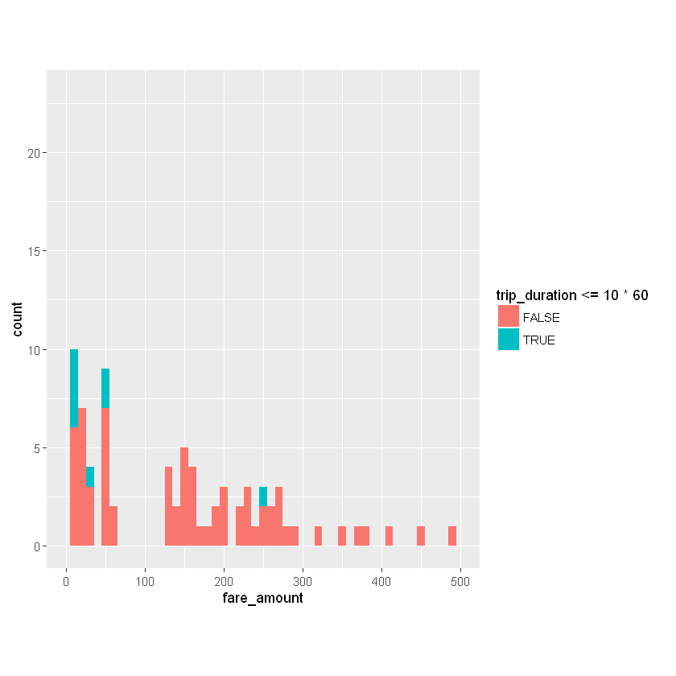


As we can see, the majority of trips that traveled over 50 miles cost nothing or next to nothing, even though most of these trips took 10 minutes or longer.  It is unclear whether such trips were the result of machine error human error, but if for example this analysis was targeted at the company that owns the taxis, this finding would warrant more investigation.

## Limiting data to Manhattan

We now narrow our field of vision by focusing on trips that took place inside of Manhattan only, and meet "reasonable" criteria for a trip.  Since we added new features to the data, we can also drop some old columns from the data so that the data can be processed faster.


```R
input_xdf <- 'yellow_tripdata_2015_manhattan.xdf'
mht_xdf <- RxXdfData(input_xdf)
```


```R
rxDataStep(nyc_xdf, mht_xdf, 
           rowSelection = (
             passenger_count > 0 &
               trip_distance >= 0 & trip_distance < 30 &
               trip_duration > 0 & trip_duration < 60*60*24 &
               str_detect(pickup_borough, 'Manhattan') &
               str_detect(dropoff_borough, 'Manhattan') &
               !is.na(pickup_nb) &
               !is.na(dropoff_nb) &
               fare_amount > 0), 
           transformPackages = "stringr",
           varsToDrop = c('extra', 'mta_tax', 'improvement_surcharge', 'total_amount', 
                          'pickup_borough', 'dropoff_borough', 'pickup_nhood', 'dropoff_nhood'),
           overwrite = TRUE)
```

    Rows Processed: 38551116 
    

And since we limited the scope of the data, it might be a good idea to create a sample of the new data (as a `data.frame`).  Our last sample, `nyc_sample_df` was not a good sample, since we only took the top 1000 rows of the data.  This time, we use `rxDataStep` to create a random sample of the data, containing only 1 percent of the rows from the larger dataset.


```R
mht_sample_df <- rxDataStep(mht_xdf, rowSelection = (u < .01), 
                            transforms = list(u = runif(.rxNumRows)))

dim(mht_sample_df)
```

    Rows Processed: 31998015 
    WARNING: The number of rows (321084) times the number of columns (24)
    exceeds the 'maxRowsByCols' argument (3000000). Rows will be truncated.
    


<ol class=list-inline>
	<li>125000</li>
	<li>24</li>
</ol>


We can use the `ggmap` package to visually inspect the sample data.  If we zoom in enough on a particular neighborhood, we can start seeing certain areas where passengers tend of get off often.


```R
library(ggmap)
map_13 <- get_map(location =  c(lon = -73.98, lat = 40.76), zoom = 13)
map_14 <- get_map(location =  c(lon = -73.98, lat = 40.76), zoom = 14)
map_15 <- get_map(location =  c(lon = -73.98, lat = 40.76), zoom = 15)

q1 <- ggmap(map_14) + 
  geom_point(aes(x = dropoff_longitude, y = dropoff_latitude), 
             data = mht_sample_df, alpha = 0.15, na.rm = TRUE, col = "red", size = .5) +
  theme_nothing(legend = TRUE)

q2 <- ggmap(map_15) + 
  geom_point(aes(x = dropoff_longitude, y = dropoff_latitude), 
             data = mht_sample_df, alpha = 0.15, na.rm = TRUE, col = "red", size = .5) +
  theme_nothing(legend = TRUE)

require(gridExtra)
grid.arrange(q1, q2, ncol = 2)
```

    Warning message:
    : package 'ggmap' was built under R version 3.2.4Map from URL : http://maps.googleapis.com/maps/api/staticmap?center=40.76,-73.98&zoom=13&size=640x640&scale=2&maptype=terrain&language=en-EN&sensor=false
    Map from URL : http://maps.googleapis.com/maps/api/staticmap?center=40.76,-73.98&zoom=14&size=640x640&scale=2&maptype=terrain&language=en-EN&sensor=false
    Map from URL : http://maps.googleapis.com/maps/api/staticmap?center=40.76,-73.98&zoom=15&size=640x640&scale=2&maptype=terrain&language=en-EN&sensor=false
    


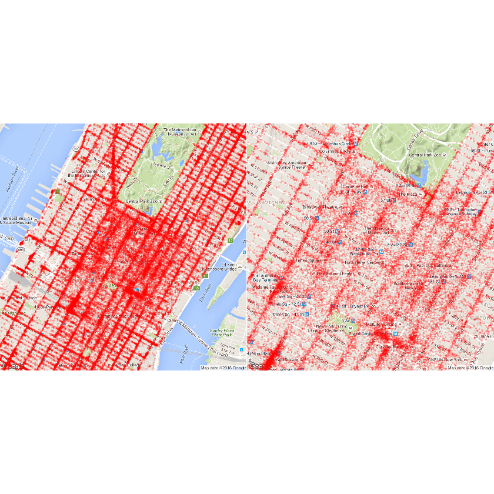


If the above plots seem too crowded, as an alternative, we could use **k-means clustering** to cluster the data based on longitude and latitude, which we would have to rescale so they have the same influence on the clusters (a simple way to rescale them is to divide longitude by -74 and latitude by 40).  Once we have the clusters, we can plot the cluster **centroids** on the map instead of the individual data points that comprise each cluster.


```R
start_time <- Sys.time()
rxkm_sample <- kmeans(transmute(mht_sample_df, long_std = dropoff_longitude / -74, lat_std = dropoff_latitude / 40), centers = 300, iter.max = 2000)
Sys.time() - start_time

# we need to put the centroids back into the original scale for coordinates
centroids_sample <- rxkm_sample$centers %>%
  as.data.frame %>%
  transmute(long = long_std*(-74), lat = lat_std*40, size = rxkm_sample$size)

head(centroids_sample)
```


    Time difference of 1.767771 secs


<table>
<thead><tr><th></th><th scope=col>long</th><th scope=col>lat</th><th scope=col>size</th></tr></thead>
<tbody>
	<tr><th scope=row>1</th><td>-74.00244</td><td>40.75606</td><td>379</td></tr>
	<tr><th scope=row>2</th><td>-73.95723</td><td>40.77024</td><td>263</td></tr>
	<tr><th scope=row>3</th><td>-73.92289</td><td>40.86694</td><td>139</td></tr>
	<tr><th scope=row>4</th><td>-73.9485</td><td>40.80988</td><td>336</td></tr>
	<tr><th scope=row>5</th><td>-73.97508</td><td>40.74778</td><td>412</td></tr>
	<tr><th scope=row>6</th><td>-74.00082</td><td>40.72794</td><td>544</td></tr>
</tbody>
</table>


In the above code chunk we used the `kmeans` function to cluster the sample dataset `mht_sample_df`. In `RevoScaleR`, there is a counterpart to the `kmeans` function called `rxKmeans`, but in addition to working with a `data.frame`, `rxKmeans` also works with XDF files.  We can therefore use `rxKmeans` to create clusters from the whole data instead of the sample represented by `mht_sample_df`.


```R
start_time <- Sys.time()
rxkm <- rxKmeans( ~ long_std + lat_std, data = mht_xdf, outFile = mht_xdf, reportProgress = -1, 
                outColName = "dropoff_cluster", overwrite = TRUE, centers = rxkm_sample$centers, 
                transforms = list(long_std = dropoff_longitude / -74, lat_std = dropoff_latitude / 40),
                blocksPerRead = 1, maxIterations = 500) # need to set this when writing to same file
Sys.time() - start_time

clsdf <- cbind(
  transmute(as.data.frame(rxkm$centers), long = long_std*(-74), lat = lat_std*40),
  size = rxkm$size, withinss = rxkm$withinss)

head(clsdf)
```


    Time difference of 4.675123 hours


<table>
<thead><tr><th></th><th scope=col>long</th><th scope=col>lat</th><th scope=col>size</th><th scope=col>withinss</th></tr></thead>
<tbody>
	<tr><th scope=row>1</th><td>-74.00245</td><td>40.75603</td><td>90865</td><td>0.00003598932</td></tr>
	<tr><th scope=row>2</th><td>-73.95728</td><td>40.77028</td><td>66701</td><td>0.00001882744</td></tr>
	<tr><th scope=row>3</th><td>-73.92265</td><td>40.86703</td><td>37560</td><td>0.0004456228</td></tr>
	<tr><th scope=row>4</th><td>-73.94795</td><td>40.80942</td><td>88652</td><td>0.0003727371</td></tr>
	<tr><th scope=row>5</th><td>-73.97514</td><td>40.74753</td><td>97575</td><td>0.00005222079</td></tr>
	<tr><th scope=row>6</th><td>-74.00032</td><td>40.72806</td><td>133905</td><td>0.00008937949</td></tr>
</tbody>
</table>


With a little bit of work, we can extract the cluster centroids from the resulting object and plot them on a similar map.  As we can see, the results are not very different, however differences do exist and depending on the use case, such small diffences can have a lot of practical significance.  If for example we wanted to find out which spots taxis are more likely to drop off passengers and make it illegal for street vendors to operate at those spots (in order to avoid creating too much traffic), we can do a much better job of narrowing down the spots using the clusters created from the whole data.


```R
centroids_whole <- cbind(
  transmute(as.data.frame(rxkm$centers), long = long_std*(-74), lat = lat_std*40),
  size = rxkm$size, withinss = rxkm$withinss)

q1 <- ggmap(map_15) +
  geom_point(data = centroids_sample, aes(x = long, y = lat, alpha = size),
             na.rm = TRUE, size = 3, col = 'red') +
  theme_nothing(legend = TRUE) +
  labs(title = "centroids using sample data")

q2 <- ggmap(map_15) +
  geom_point(data = centroids_whole, aes(x = long, y = lat, alpha = size),
             na.rm = TRUE, size = 3, col = 'red') +
  theme_nothing(legend = TRUE) +
  labs(title = "centroids using whole data")

require(gridExtra)
grid.arrange(q1, q2, ncol = 2)
```


## Spatial patterns

As our next task, we seek to find patterns between pickup and dropoff neighborhoods and other variables such as fare amount, trip distance, traffic and tipping.

### Distances and traffic

Trip distance is shown in the data.  To estimate traffic by looking at the ratio of trip duration and trip distance, assuming that traffic is the most common reason for trips taking longer than they should.

For this analysis, we use the `rxCube` and `rxCrossTabs` are both very similar to `rxSummary` but they return fewer statistical summaries and therefore run faster.  With `y ~ u:v` as the formula, `rxCrossTabs` returns counts and sums, and `rxCube` returns counts and averages for column `y` broken up by any combinations of columns `u` and `v`.  Another important difference between the two functions is that `rxCrossTabs` returns an array but `rxCube` returns a `data.frame`.  Depending on the application in question, we may prefer one to the other (and of course we can always convert one form to the other by "reshaping" it, but doing so would involve extra work).

Let's see what this means in action: We start by using `rxCrossTabs` to get sums and counts for `trip_distance`, broken up by `pickup_nb` and `dropoff_nb`.  We can immediately divide the sums by the counts to get averages.  The result is called a **distance matirx** and can be fed to the `seriate` function in the `seriation` library to order it so closer neighborhoods appear next to each other (right now neighborhoods are sorted alphabetically, which is what R does by default with factor levels unless otherwise specified).


```R
rxct <- rxCrossTabs(trip_distance ~ pickup_nb:dropoff_nb, mht_xdf)
res <- rxct$sums$trip_distance / rxct$counts$trip_distance

library(seriation)
res[which(is.nan(res))] <- mean(res, na.rm = TRUE)
nb_order <- seriate(res)
```

    Rows Processed: 31998015 
    

We will use `nb_order` in a little while, but before we do so, let's use `rxCube` to get counts and averages for `trip_distance`, a new data point representing minutes spent in the taxi per mile of the trip, and `tip_percent`.  In the above example, we used `rxCrossTabs` because we wanted a matrix as the return object, so we could feed it to `seriate`.  We now use `rxCube` to get a `data.frame` instead, since we intend to use it for plotting with `ggplot2`, which is more easier to code using a long `data.frame` as input compared to a wide `matirx`.


```R
rxc1 <- rxCube(trip_distance ~ pickup_nb:dropoff_nb, mht_xdf)
rxc2 <- rxCube(minutes_per_mile ~ pickup_nb:dropoff_nb, mht_xdf, 
               transforms = list(minutes_per_mile = (trip_duration/60)/trip_distance))
rxc3 <- rxCube(tip_percent ~ pickup_nb:dropoff_nb, mht_xdf)
res <- bind_cols(list(rxc1, rxc2, rxc3))
res <- res[ , c('pickup_nb', 'dropoff_nb', 'trip_distance', 'minutes_per_mile', 'tip_percent')]
head(res)
```

    Rows Processed: 31998015 
    Rows Processed: 31998015 
    Rows Processed: 31998015 
    


<table>
<thead><tr><th></th><th scope=col>pickup_nb</th><th scope=col>dropoff_nb</th><th scope=col>trip_distance</th><th scope=col>minutes_per_mile</th><th scope=col>tip_percent</th></tr></thead>
<tbody>
	<tr><th scope=row>1</th><td>Battery Park</td><td>Battery Park</td><td>1.005716</td><td>9.80911</td><td>11.45848</td></tr>
	<tr><th scope=row>2</th><td>Carnegie Hill</td><td>Battery Park</td><td>8.442372</td><td>3.476283</td><td>10.94513</td></tr>
	<tr><th scope=row>3</th><td>Central Park</td><td>Battery Park</td><td>6.113357</td><td>4.602953</td><td>9.595821</td></tr>
	<tr><th scope=row>4</th><td>Chelsea</td><td>Battery Park</td><td>2.987114</td><td>4.754227</td><td>11.77189</td></tr>
	<tr><th scope=row>5</th><td>Chinatown</td><td>Battery Park</td><td>1.817667</td><td>6.656269</td><td>9.918847</td></tr>
	<tr><th scope=row>6</th><td>Clinton</td><td>Battery Park</td><td>3.980162</td><td>4.240237</td><td>9.902321</td></tr>
</tbody>
</table>


We can start plotting the above results to see some interesting trends.


```R
library(ggplot2)
ggplot(res, aes(pickup_nb, dropoff_nb)) + 
  geom_tile(aes(fill = trip_distance), colour = "white") + 
  theme(axis.text.x = element_text(angle = 60, hjust = 1)) +
  scale_fill_gradient(low = "white", high = "steelblue") + 
  coord_fixed(ratio = .9)
```


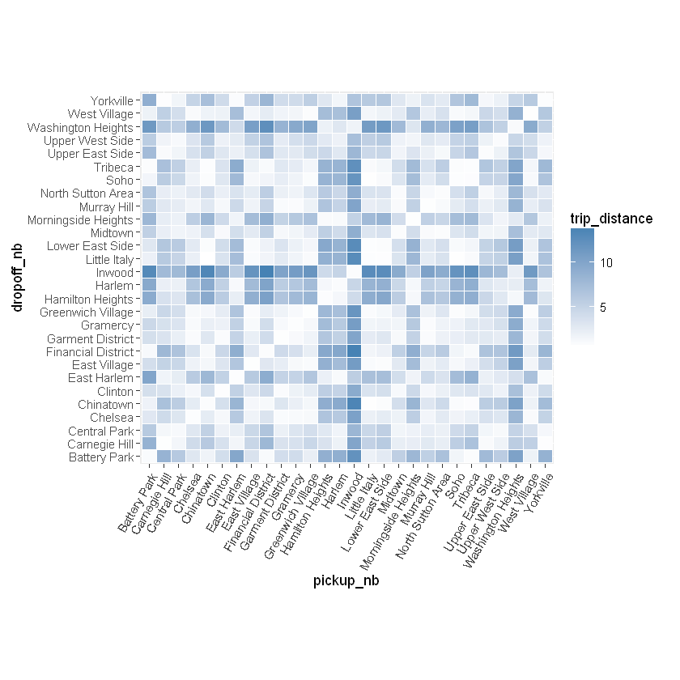


The problem with the above plot is the order of the neighborhoods (which is alphabetical), which makes the plot somewhat arbitrary and useless.  But as we saw above, using the `seriate` function we found a more natural ordering for the neighborhoods, so we can use it to reorder the above plot in a more suitable way.  To reorder the plot, all we need to do is reorder the factor levels in the order given by `nb_order`.


```R
newlevs <- levels(res$pickup_nb)[unlist(nb_order)]
res$pickup_nb <- factor(res$pickup_nb, levels = unique(newlevs))
res$dropoff_nb <- factor(res$dropoff_nb, levels = unique(newlevs))

library(ggplot2)
ggplot(res, aes(pickup_nb, dropoff_nb)) + 
  geom_tile(aes(fill = trip_distance), colour = "white") + 
  theme(axis.text.x = element_text(angle = 60, hjust = 1)) +
  scale_fill_gradient(low = "white", high = "steelblue") + 
  coord_fixed(ratio = .9)
```


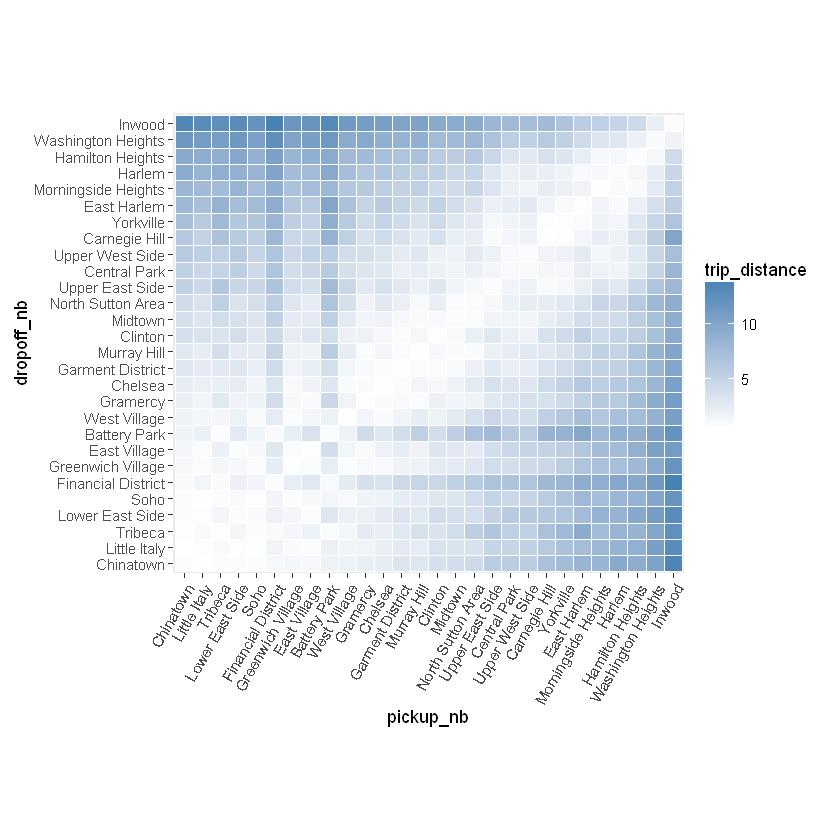


Since trip distances remain fix, but trip duration mostly is a function of how much traffic there is, we can plot a look at the same plot as the above, but for the `minutes_per_mile` column, which will give us an idea of which neigborhoods have the most traffic between them.


```R
ggplot(res, aes(pickup_nb, dropoff_nb)) + 
  geom_tile(aes(fill = minutes_per_mile), colour = "white") + 
  theme(axis.text.x = element_text(angle = 60, hjust = 1)) + 
  scale_fill_gradient(low = "white", high = "steelblue") + 
  coord_fixed(ratio = .9)
```


As the plot shows, a lot of traffic happens between neighborhoods that are close to each other.  This is not very surprising since trips between neighborhoods that are far apart can be made using periphery routes that bypass most of the traffic through the town center.  We can also see generally high traffic in the midtown neighborhoods, and downtown especially between Chinatown and Little Italy.

We changed the order of the factor levels for `pickup_nb` and `dropoff_nb` to draw the above plots. However, this change best belongs in the data itself, otherwise every time we plot something involving `pickup_nb` or `dropoff_nb` we will need to change the order of the factor levels. So let's take the change and apply it to the whole data. We have two options for making the change:

  1. We can use `rxDataStep` with the `transforms` argument, and use the `base` R function `factor` to reorder the factor levels.
  2. We can use the `rxFactor` function and its `factorInfo` to manipulate the factors levels. The advantage of `rxFactors` is that it is faster, because it works at the metadata level. The disadvantage is that it may not work in other compute contexts such as Hadoop or Spark.
  
Both ways of doing this are shown here.


```R
# first way of reordering the factor levels
rxDataStep(inData = mht_xdf, outFile = mht_xdf,
           transforms = list(pickup_nb = factor(pickup_nb, levels = newlevels),
                             dropoff_nb = factor(dropoff_nb, levels = newlevels)),
           transformObjects = list(newlevels = unique(newlevs)),
           overwrite = TRUE)
```

    Rows Processed: 31998015 
    


    Error in rxFactors(mht_xdf, factorInfo = list(pickup_nb = list(newLevels = newlevels), : object 'newlevels' not found
    


```R
# second way of reordering the factor levels
rxFactors(mht_xdf, outFile = mht_xdf, factorInfo = list(pickup_nb = list(newLevels = unique(newlevs)), 
                                                        dropoff_nb = list(newLevels = unique(newlevs))),
         overwrite = TRUE)
```

    Rows Processed: 31998015 
    

### Fare amount and tipping behavior

Another interesting question to consider is the relationship between the fare amount and how much passengers tip in relation to which neighborhoods they travel between.  We create another plot similar to the ones above, showing fare amount on a grey background color scale, and displaying how much passengers tipped on average for the trip.  To make it easier to visually see patterns in tipping behavior, we color-code the average tip based on whether it's over 12%, less than 12%, less than 10%, less than 8%, and less than 5%.


```R
res %>%
  mutate(tip_color = cut(tip_percent, c(0, 5, 8, 10, 12, 100))) %>%
  ggplot(aes(pickup_nb, dropoff_nb)) + 
  geom_tile(aes(fill = tip_color)) + 
  theme(axis.text.x = element_text(angle = 60, hjust = 1)) + 
  coord_fixed(ratio = .9)
```


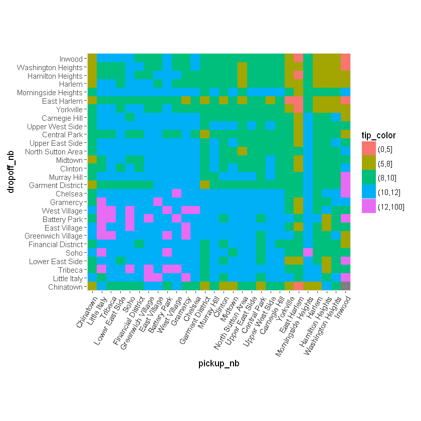


Some interesting results stand out:

- Trips leaving Battery Park or the Financial District going to midtown or uptown neighborhoods seem to cost a little more than seems warranted, and same trips leaving Greenwich Village going to Chinatown.
- Trips into and out of Chinatown tip consistently low (below 10%), especially if traveling to or coming from midtown and uptown neighborhoods.
- The most generous tippers (around 12%) are the ones traveling between downtown neighborhoods (except for Chinatown).  The next most generous tippers (around 11%) are the ones traveling between midtown neighborhoods and downtown neighborhoods in either direction.  The worst tippers are the one traveling between uptown neighborhoods.

### Overall and marginal distribution of trips

Let's focus our attention now to two other important questions:
- Between which neighborhoods do the most common trips occur?  
- Assuming that a traveler leaves out of a given neighborhood, which neighborhoods are they likely to go to?
- Assuming that someone was just dropped off at a given neighborhood, which neighborhoods are they most likely to have come from?

To answer the above questions, we need to find the distribution (or proportion) of trips between any pair of neighborhoods, first as a percentage of total trips, then as a percentage of trips *leaving out of* a particular neighborhood, and finally as a percentage of trips *going to* a particular neighborhood.


```R
rxc <- rxSummary(trip_distance ~ pickup_nb:dropoff_nb, mht_xdf)
rxc <- rxc$categorical[[1]][ , -1]

library(dplyr)
rxc %>% 
  filter(ValidObs > 0) %>%
  mutate(pct_all = ValidObs/sum(ValidObs) * 100) %>%
  group_by(pickup_nb) %>%
  mutate(pct_by_pickup_nb = ValidObs/sum(ValidObs) * 100) %>%
  group_by(dropoff_nb) %>%
  mutate(pct_by_dropoff_nb = ValidObs/sum(ValidObs) * 100) %>%
  group_by() %>%
  arrange(desc(ValidObs)) -> rxcs

head(rxcs)
```

    Rows Processed: 31998015 
    


<table>
<thead><tr><th></th><th scope=col>pickup_nb</th><th scope=col>dropoff_nb</th><th scope=col>Means</th><th scope=col>StdDev</th><th scope=col>Min</th><th scope=col>Max</th><th scope=col>ValidObs</th><th scope=col>pct_all</th><th scope=col>pct_by_pickup_nb</th><th scope=col>pct_by_dropoff_nb</th></tr></thead>
<tbody>
	<tr><th scope=row>1</th><td>Upper East Side</td><td>Upper East Side</td><td>0.8942413</td><td>0.5642486</td><td>0</td><td>29.6</td><td>1760523</td><td>5.501976</td><td>36.22139</td><td>37.63459</td></tr>
	<tr><th scope=row>2</th><td>Midtown</td><td>Midtown</td><td>0.8598139</td><td>0.6690569</td><td>0</td><td>29.75</td><td>1302615</td><td>4.070924</td><td>22.90525</td><td>23.35577</td></tr>
	<tr><th scope=row>3</th><td>Upper West Side</td><td>Upper West Side</td><td>1.001931</td><td>0.6523203</td><td>0</td><td>28.7</td><td>1034706</td><td>3.233657</td><td>34.41997</td><td>34.51401</td></tr>
	<tr><th scope=row>4</th><td>Midtown</td><td>Upper East Side</td><td>1.677654</td><td>0.7264508</td><td>0</td><td>28.08</td><td>882347</td><td>2.757505</td><td>15.51524</td><td>18.86188</td></tr>
	<tr><th scope=row>5</th><td>Upper East Side</td><td>Midtown</td><td>1.635489</td><td>0.7116099</td><td>0</td><td>29.2</td><td>881902</td><td>2.756115</td><td>18.14445</td><td>15.81242</td></tr>
	<tr><th scope=row>6</th><td>Garment District</td><td>Midtown</td><td>1.252271</td><td>0.490916</td><td>0</td><td>28.75</td><td>562598</td><td>1.758228</td><td>28.51825</td><td>10.08733</td></tr>
</tbody>
</table>


Based on the first row, we can see that trips from the Upper East Side to the Upper East Side make up about 5% of all trips in Manhattan.  Of all the trips that pick up in the Upper East Side, about 36% drop off in the Upper East Side.  Of all the trips that drop off in the Upper East Side, 37% and tripped that also picked up in the Upper East Side.

We can take the above numbers and display them in plots that make it easier to digest it all at once.  We begin with a plot showing how taxi trips between any pair of neighborhoods are distributed.


```R
ggplot(rxcs, aes(pickup_nb, dropoff_nb)) + 
  geom_tile(aes(fill = pct_all), colour = "white") + 
  theme(axis.text.x = element_text(angle = 60, hjust = 1)) +
  scale_fill_gradient(low = "white", high = "black") + 
  coord_fixed(ratio = .9)
```


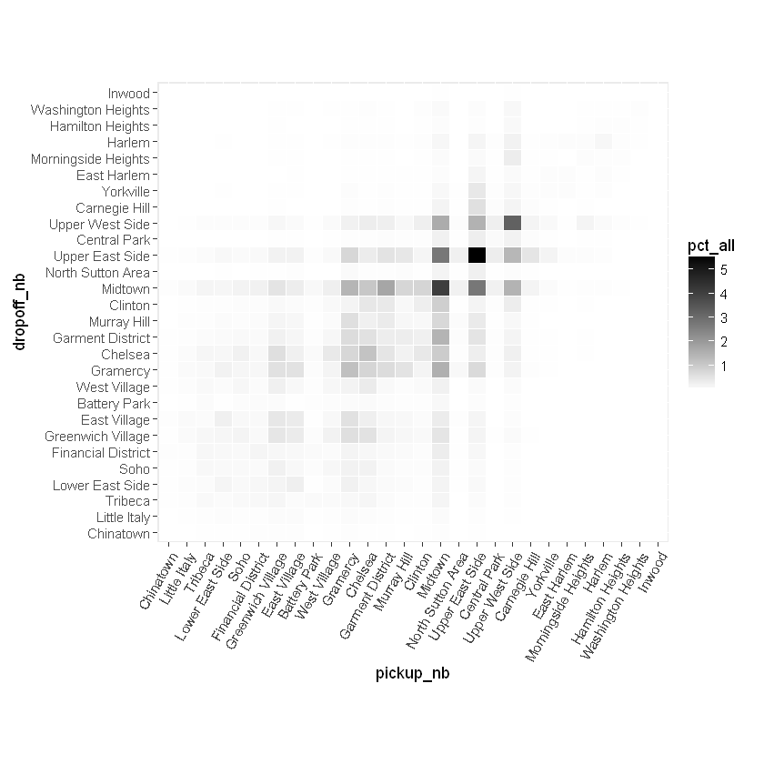


The plot shows that trips to and from the Upper East Side make up the majority of trips, a somewhat unexpected result.  Furthermore, the lion's share of trips are to and from the Upper East Side and the Upper West Side and the midtown neighborhoods (with most of this category having Midtown either as an origin or a destination).  Another surprising fact about the above plot is its near symmetry, which suggests that perhaps most passengers use taxis for a "round trip", meaning that they take a taxi to their destination, and another taxi for the return trip.  This point warrants further inquiry (perhaps by involving the time of day into the analysis) but for now we leave it at that.

Next we look at how trips leaving a particular neighborhood (a point on the x-axis in the plot below), "spill out" into other neighborhoods (shown by the vertical color gradient along the y-axis at each point on the x-axis).


```R
ggplot(rxcs, aes(pickup_nb, dropoff_nb)) + 
  geom_tile(aes(fill = pct_by_pickup_nb), colour = "white") + 
  theme(axis.text.x = element_text(angle = 60, hjust = 1)) +
  scale_fill_gradient(low = "white", high = "steelblue") + 
  coord_fixed(ratio = .9)
```


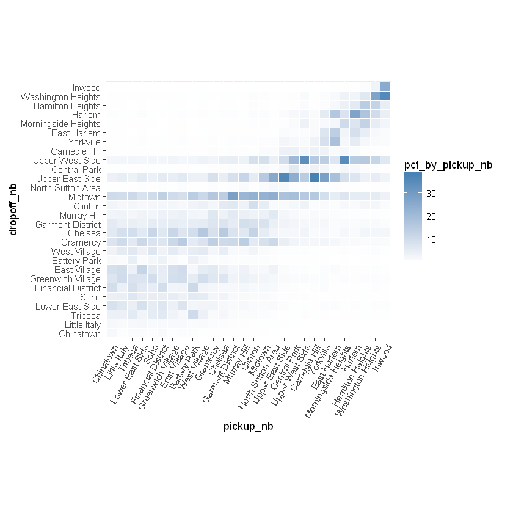


We can see how most downtown trips are to other downtown neighborhoods or to midtown neighborhoods (especially Midtown).  Midtown and the Upper East Side are common destinations from any neighborhood, and the Upper West Side is a common destination for most uptown neighborhoods.

For a trip ending at a particular neighborhood (represented by a point on the y-axis) we now look at the distribution of where the trip originated from (the horizontal color-gradient along the x-axis for each point on the y-axis).


```R
ggplot(rxcs, aes(pickup_nb, dropoff_nb)) + 
  geom_tile(aes(fill = pct_by_dropoff_nb), colour = "white") + 
  theme(axis.text.x = element_text(angle = 60, hjust = 1)) +
  scale_fill_gradient(low = "white", high = "red") + 
  coord_fixed(ratio = .9)
```


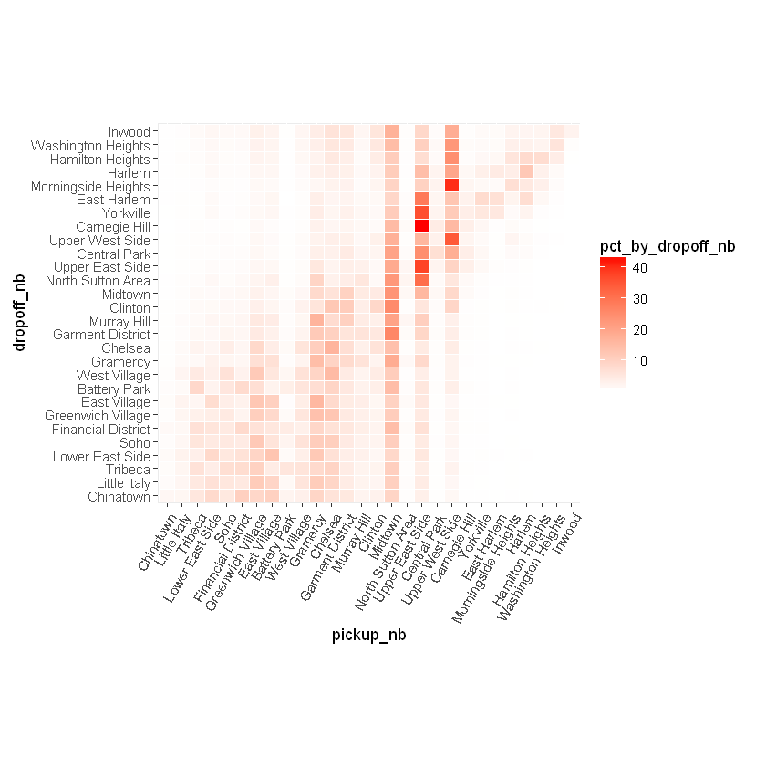


As we can see, a lot of trips claim Midtown regardless of where they ended.  The Upper East Side and Upper West Side are also common origins for trips that drop off in one of the uptown neighborhoods.

### Differences throughout the day

It is helpful to see whether trips between certain neighborhoods are more likely to occur sooner or later in the day, which can be answered with the plot shown here, which is color-coded by the average hour of the day the trips occured.


```R
res <- rxCube(pickup_hour ~ pickup_nb:dropoff_nb, mht_xdf,
              transforms = list(pickup_hour = hour(ymd_hms(tpep_pickup_datetime, tz = "UTC"))),
              transformPackages = "lubridate")
res <- as.data.frame(res)

ggplot(res, aes(pickup_nb, dropoff_nb)) + 
  geom_tile(aes(fill = pickup_hour), colour = "white") + 
  theme(axis.text.x = element_text(angle = 60, hjust = 1)) +
  scale_fill_gradient(low = "white", high = "darkblue") + 
  coord_fixed(ratio = .9)
```

    Rows Processed: 31998015 
    


Some neighborhoods like East Village, Little Italy, West Village (all famous for their night life) stand out as popular destination after work hours, while neighborhoods like the Financial District, Battery Park and Midtown (business neighborhoods) are neighborhoods that people tend to go to early in the day.

## Temporal patterns

We've so far only focus on spatial patterns, i.e. between the various neighborhoods.  Let's now see what sorts of insights can be derived from temporal columns we extracted from the data, namely the day of the week and the hour the traveler was picked up.


```R
res1 <- rxCube(tip_percent ~ pickup_dow:pickup_hour, mht_xdf)
res2 <- rxCube(fare_amount/(trip_duration/60) ~ pickup_dow:pickup_hour, mht_xdf)
names(res2)[3] <- 'fare_per_minute'
res <- bind_cols(list(res1, res2))
res <- res[ , c('pickup_dow', 'pickup_hour', 'fare_per_minute', 'tip_percent', 'Counts')]

library(ggplot2)
ggplot(res, aes(pickup_dow, pickup_hour)) + 
  geom_tile(aes(fill = fare_per_minute), colour = "white") + 
  theme(axis.text.x = element_text(angle = 60, hjust = 1)) +
  scale_fill_gradient(low = "white", high = "steelblue") +
  geom_text(aes(label = sprintf('%dK riders\n (%d%% tip)', signif(Counts/1000, 2), round(tip_percent, 0))), size = 2.5) + 
  coord_fixed(ratio = .9)
```

    Rows Processed: 31998015 
    Rows Processed: 31998015 
    


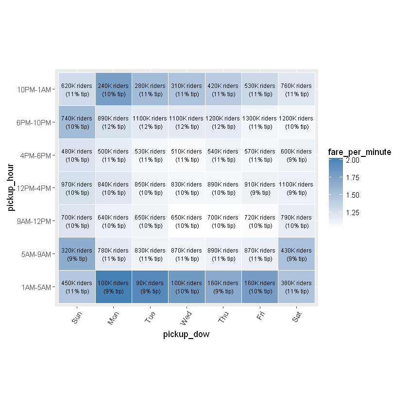


We can see from the above plot that a cab ride costs the more on a weekend than a weekday if it's taken between 5AM and 10PM, and vice versa from 10PM to 5AM.  The plot also suggests that passengers tip slightly more on weekdays and especially right after office hours.  The question of tipping should be more closely looked at, especially since the percentage people tip is affected by whether people use cash or card, which so far we've ignored.

## Predicting tip amount

Our next exercise will consist of using several analytics functions offered by `RevoScaleR` to build models for predicting the amount customers tip for a trip. We will use the pick-up and drop-off neighborhoods and the time and day of the trip as the variables most likely to influence tip. Let's begin by building a linear model involving two interactive terms: one between `pickup_nb` and `dropoff_nb` and another one between `pickup_dow` and `pickup_hour`. The idea here is that we think trip percent is not just influenced by which neighborhood the passengers was pickup up from, or which neighborhood they were dropped off to, but which neighborhood they were picked up from AND dropped off to. Similarly, we intuit that the day of the week and the hour of the day together infulence tipping. For example, just becuase people tip high on Sundays between 9 and 12, doesn't mean that they tend to tip high any day of the week between 9 and 12PM, or any time of the day on a Sunday. This intuition is encoded in the model formula argument that we pass to the `rxLinMod` function: `tip_percent ~ pickup_nb:dropoff_nb + pickup_dow:pickup_hour` where we use `:` to separate interactive terms and `+` to separate additive terms.


```R
rxlm <- rxLinMod(tip_percent ~ pickup_nb:dropoff_nb + pickup_dow:pickup_hour, data = mht_xdf, dropFirst = TRUE, covCoef = TRUE)
rxs <- rxSummary( ~ pickup_nb + dropoff_nb + pickup_hour + pickup_dow, mht_xdf)
```

    Rows Processed: 31998015 
    Rows Processed: 31998015 
    

Examining the model coefficients individually is a daunting task because of how many there are. Moreover, when working with big datasets, a lot of coefficients come out as statistically significant by virtue of large sample size, without necessarily being practically significant. Instead for now we just look at how our predictions are looking. We start by extracting each variable's factor levels into a `list` which we can pass to `expand.grid` to create a dataset with all the possible combinations of the factor levels. We then use `rxPredict` to predict `tip_percent` using the above model.


```R
ll <- lapply(rxs$categorical, function(x) x[ , 1])
names(ll) <- c('pickup_nb', 'dropoff_nb', 'pickup_hour', 'pickup_dow')
pred_df <- expand.grid(ll)
pred_df <- rxPredict(rxlm, data = pred_df, computeStdErrors = TRUE, writeModelVars = TRUE)
head(pred_df, 10)
```

    Rows Processed: 38416 
    


<table>
<thead><tr><th></th><th scope=col>tip_percent_Pred</th><th scope=col>tip_percent_StdErr</th><th scope=col>pickup_nb</th><th scope=col>dropoff_nb</th><th scope=col>pickup_dow</th><th scope=col>pickup_hour</th></tr></thead>
<tbody>
	<tr><th scope=row>1</th><td>7.233543</td><td>0.2083615</td><td>Chinatown</td><td>Chinatown</td><td>Sun</td><td>1AM-5AM</td></tr>
	<tr><th scope=row>2</th><td>10.36499</td><td>0.2032116</td><td>Little Italy</td><td>Chinatown</td><td>Sun</td><td>1AM-5AM</td></tr>
	<tr><th scope=row>3</th><td>8.595942</td><td>0.1200959</td><td>Tribeca</td><td>Chinatown</td><td>Sun</td><td>1AM-5AM</td></tr>
	<tr><th scope=row>4</th><td>9.513033</td><td>0.09828536</td><td>Lower East Side</td><td>Chinatown</td><td>Sun</td><td>1AM-5AM</td></tr>
	<tr><th scope=row>5</th><td>9.750391</td><td>0.125316</td><td>Soho</td><td>Chinatown</td><td>Sun</td><td>1AM-5AM</td></tr>
	<tr><th scope=row>6</th><td>8.503645</td><td>0.08739044</td><td>Financial District</td><td>Chinatown</td><td>Sun</td><td>1AM-5AM</td></tr>
	<tr><th scope=row>7</th><td>10.80359</td><td>0.09473793</td><td>Greenwich Village</td><td>Chinatown</td><td>Sun</td><td>1AM-5AM</td></tr>
	<tr><th scope=row>8</th><td>10.43543</td><td>0.08830769</td><td>East Village</td><td>Chinatown</td><td>Sun</td><td>1AM-5AM</td></tr>
	<tr><th scope=row>9</th><td>8.786953</td><td>0.1808477</td><td>Battery Park</td><td>Chinatown</td><td>Sun</td><td>1AM-5AM</td></tr>
	<tr><th scope=row>10</th><td>10.54659</td><td>0.1551874</td><td>West Village</td><td>Chinatown</td><td>Sun</td><td>1AM-5AM</td></tr>
</tbody>
</table>


We can now visualize the model's predictions by plotting the average predictions for all combinations of the interactive terms.


```R
ggplot(pred_df, aes(x = pickup_nb, y = dropoff_nb)) + 
  geom_tile(aes(fill = tip_percent_Pred), colour = "white") + 
  theme(axis.text.x = element_text(angle = 60, hjust = 1)) +
  scale_fill_gradient(low = "white", high = "red") + 
  coord_fixed(ratio = .9)
```


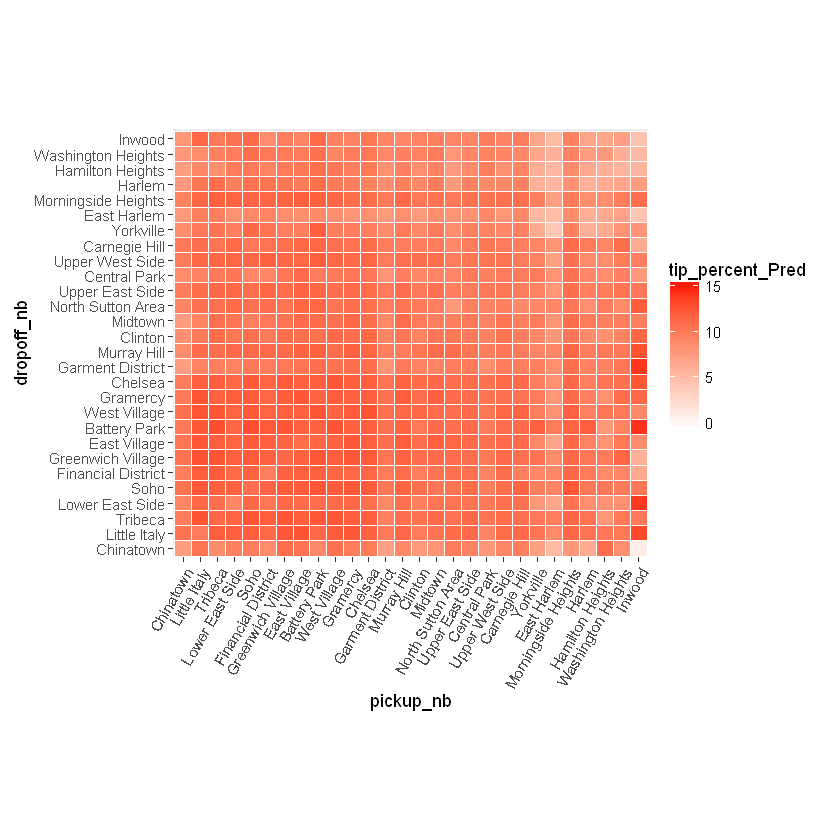


```R
ggplot(pred_df, aes(x = pickup_dow, y = pickup_hour)) + 
  geom_tile(aes(fill = tip_percent_Pred), colour = "white") + 
  theme(axis.text.x = element_text(angle = 60, hjust = 1)) +
  scale_fill_gradient(low = "white", high = "red") + 
  coord_fixed(ratio = .9)
```


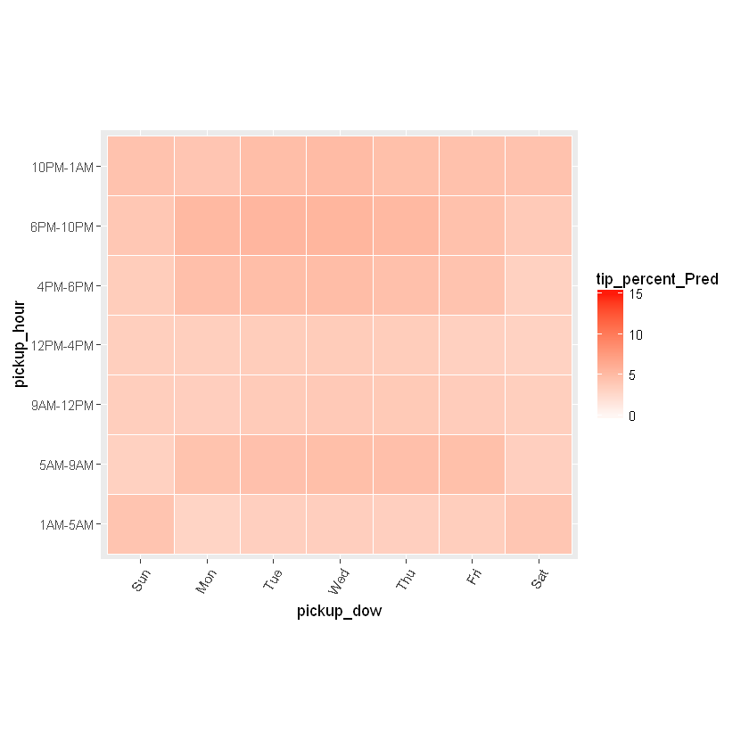


A question we might ask ourselves is how important is the interaction between `pickup_dow` and `pickup_hour` to the predictions? How much worse would the predictions be if we only kept the interaction between `pickup_nb` and `dropoff_nb` and dropped the second interactive term? To answer this, we can build a simpler model with `rxLinMod` in which we only include `pickup_nb:dropoff_nb`. We then predict with the simpler model and use `cbind` to append the new predictions next to the data with the old predictions we made with the more complex model.


```R
rxlm_simple <- rxLinMod(tip_percent ~ pickup_nb:dropoff_nb, data = mht_xdf, dropFirst = TRUE, covCoef = TRUE)
pred_df_simple <- rxPredict(rxlm_simple, data = pred_df, computeStdErrors = TRUE, writeModelVars = TRUE)
names(pred_df_simple)[1:2] <- paste(names(pred_df_simple)[1:2], 'simple', sep = '_')

pred_df <- pred_df_simple %>% 
  select(starts_with('tip_percent')) %>%
  cbind(pred_df) %>%
  arrange(pickup_nb, dropoff_nb, pickup_dow, pickup_hour) %>%
  select(pickup_dow, pickup_hour, pickup_nb, dropoff_nb, starts_with('tip_percent'))

head(pred_df)
```

    Rows Processed: 31998015 
    Rows Processed: 38416 
    


<table>
<thead><tr><th></th><th scope=col>pickup_dow</th><th scope=col>pickup_hour</th><th scope=col>pickup_nb</th><th scope=col>dropoff_nb</th><th scope=col>tip_percent_Pred_simple</th><th scope=col>tip_percent_StdErr_simple</th><th scope=col>tip_percent_Pred</th><th scope=col>tip_percent_StdErr</th></tr></thead>
<tbody>
	<tr><th scope=row>1</th><td>Sun</td><td>1AM-5AM</td><td>Chinatown</td><td>Chinatown</td><td>7.144867</td><td>0.2085486</td><td>7.233543</td><td>0.2083615</td></tr>
	<tr><th scope=row>2</th><td>Sun</td><td>5AM-9AM</td><td>Chinatown</td><td>Chinatown</td><td>7.144867</td><td>0.2085486</td><td>6.164842</td><td>0.2085528</td></tr>
	<tr><th scope=row>3</th><td>Sun</td><td>9AM-12PM</td><td>Chinatown</td><td>Chinatown</td><td>7.144867</td><td>0.2085486</td><td>6.452217</td><td>0.2082159</td></tr>
	<tr><th scope=row>4</th><td>Sun</td><td>12PM-4PM</td><td>Chinatown</td><td>Chinatown</td><td>7.144867</td><td>0.2085486</td><td>6.326927</td><td>0.2081387</td></tr>
	<tr><th scope=row>5</th><td>Sun</td><td>4PM-6PM</td><td>Chinatown</td><td>Chinatown</td><td>7.144867</td><td>0.2085486</td><td>6.530122</td><td>0.208348</td></tr>
	<tr><th scope=row>6</th><td>Sun</td><td>6PM-10PM</td><td>Chinatown</td><td>Chinatown</td><td>7.144867</td><td>0.2085486</td><td>7.00972</td><td>0.208201</td></tr>
</tbody>
</table>


We can see from the results above that the predictions with the simpler model are identical across all the days of the week and all the hours for the same pick-up and drop-off combination.  Whereas the predictions by the more complex model are unique for every combination of all four variables.  In other words, adding `pickup_dow:pickup_hour` to the model adds extra variation to the predictions, and what we'd like to know is if this variation contains important signals or if it more or less bahaves like noise. To get to the answer, we compare the distribution of the two predictions when we break them up by `pickup_dow` and `pickup_hour`.


```R
ggplot(data = pred_df) +
  geom_density(aes(x = tip_percent_Pred, col = "complex")) +
  geom_density(aes(x = tip_percent_Pred_simple, col = "simple")) +
  facet_grid(pickup_hour ~ pickup_dow)
```


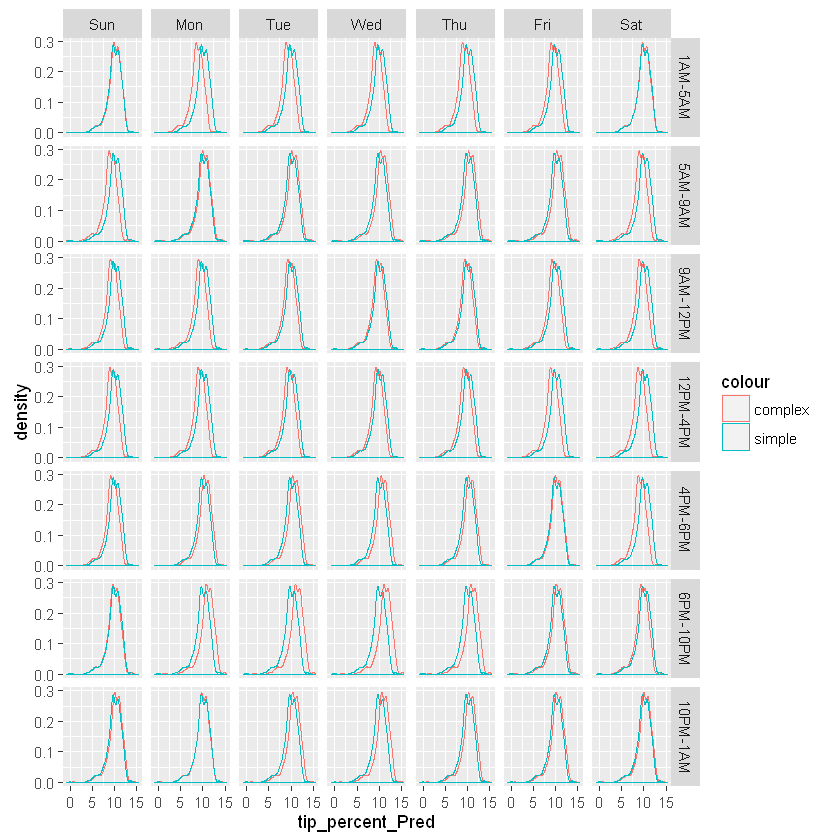


The simpler model shows the same distribution all throughout, because these two variables have no effect on its predictions, but the more complex model shows a slightly different distribution for each combination of `pickup_dow` and `pickup_hour`, usually in the form of a slight shift in the distribution. That shift represents the effect of `pickup_dow` and `pickup_hour` at each given combination of the two variables. Because the shift is directional (not haphazard), it's safe to say that it captures some kind of important signal (although its practical significance is still up for debate).

So far we've only looked at two models from the same `rxLinMod` algorithm. When comparing the two, we looked at the way their predictions capture the effects of the variables used to build each model. To do the comparison, we built a dataset with all combinations of the variables used to build the models with, and then scored that dataset with the two models using `rxPredict`. By doing so we can see how the predictions are distributed, but we still don't know if the predictions are good. The true test of a model's performance is in its ability to predict **out of sample**, which is why we split the data in two and set aside a portion of it for model testing. 

To divide the data into training and testing portions, we first used `rxDataStep` to create a new `factor` column called `split` where each row is `"train"` or `"test"` such that a given proportion of the data (here 75 precent) is used to train a model and the rest is used to test the model's predictive power. We then used the `rxSplit` function to divide the data into the two portions. The `rx_split_xdf` function we create here combines the two steps into one and sets some arguments to defaults.


```R
dir.create('output', showWarnings = FALSE)
rx_split_xdf <- function(xdf = mht_xdf,
                         split_perc = 0.75,
                         output_path = "output/split",
                         ...) {
  
  # first create a column to split by
  outFile <- tempfile(fileext = 'xdf')
  rxDataStep(inData = xdf,
             outFile = xdf,
             transforms = list(
               split = factor(ifelse(rbinom(.rxNumRows, size = 1, prob = splitperc), "train", "test"))),
             transformObjects = list(splitperc = split_perc),
             overwrite = TRUE, ...)

  # then split the data in two based on the column we just created
  splitDS <- rxSplit(inData = xdf,
                     outFilesBase = file.path(output_path, "train"),
                     splitByFactor = "split",
                     overwrite = TRUE)
  
  return(splitDS)
}

# we can now split to data in two
mht_split <- rx_split_xdf(xdf = mht_xdf, varsToKeep = c('payment_type', 'fare_amount', 'tip_amount', 'tip_percent', 'pickup_hour', 
                                                        'pickup_dow', 'pickup_nb', 'dropoff_nb', 'dropoff_cluster'))
names(mht_split) <- c("train", "test")
```

    Rows Processed: 31998015 
    Rows Processed: 31998015 
    

We now run three different algorithms on the data:

  - `rxLinMod`, the linear model from earlier with the terms `tip_percent ~ pickup_nb:dropoff_nb + pickup_dow:pickup_hour`
  - `rxDTree`, the decision tree algorithm with the terms `tip_percent ~ pickup_nb + dropoff_nb + pickup_dow + pickup_hour` (decision trees don't need interactive factors because interactions are built into the algorithm itself)
  - `rxDForest`, the random forest algorithm with the same terms as decision trees
  
Since this is not a modeling course, we will not discuss how the algorthims are implemented. Instead we run the algorithms and use them to predict tip percent on the test data so we can see which one works better.


```R
system.time(linmod <- rxLinMod(tip_percent ~ pickup_nb:dropoff_nb + pickup_dow:pickup_hour, 
                               data = mht_split$train, reportProgress = 0))
system.time(dtree <- rxDTree(tip_percent ~ pickup_nb + dropoff_nb + pickup_dow + pickup_hour, 
                             data = mht_split$train, pruneCp = "auto", reportProgress = 0))
system.time(dforest <- rxDForest(tip_percent ~ pickup_nb + dropoff_nb + pickup_dow + pickup_hour, 
                                 mht_split$train, nTree = 10, importance = TRUE, useSparseCube = TRUE, reportProgress = 0))
```


       user  system elapsed 
       0.01    0.00    1.26 


       user  system elapsed 
       0.03    0.05  664.23 


       user  system elapsed 
       0.00    0.02  538.96 


Since running the above algorithms can take a while, it may be worth saving the models that each return.


```R
trained.models <- list(linmod = linmod, dtree = dtree, dforest = dforest)
save(trained.models, file = 'trained.models.Rdata')
```

Before applying the algorithm to the test data, let's apply it to the small dataset with all the combinations of categorical variables and visualize the predictions. This might help us develop some intuition about each algorithm.


```R
ll <- lapply(rxs$categorical, function(x) x[ , 1])
names(ll) <- c('pickup_nb', 'dropoff_nb', 'pickup_hour', 'pickup_dow')
pred_df <- expand.grid(ll)
pred_df_1 <- rxPredict(trained.models$linmod, data = pred_df, predVarNames = "tip_percent_pred_linmod")
pred_df_2 <- rxPredict(trained.models$dtree, data = pred_df, predVarNames = "tip_percent_pred_dtree")
pred_df_3 <- rxPredict(trained.models$dforest, data = pred_df, predVarNames = "tip_percent_pred_dforest")
pred_df <- do.call(cbind, list(pred_df, pred_df_1, pred_df_2, pred_df_3))
head(pred_df)

ggplot(data = pred_df) +
  geom_density(aes(x = tip_percent_pred_linmod, col = "linmod")) +
  geom_density(aes(x = tip_percent_pred_dtree, col = "dtree")) +
  geom_density(aes(x = tip_percent_pred_dforest, col = "dforest")) # + facet_grid(pickup_hour ~ pickup_dow)
```

    Rows Processed: 38416 
    Rows Processed: 38416 
    Rows Processed: 38416 
    


<table>
<thead><tr><th></th><th scope=col>pickup_nb</th><th scope=col>dropoff_nb</th><th scope=col>pickup_hour</th><th scope=col>pickup_dow</th><th scope=col>tip_percent_pred_linmod</th><th scope=col>tip_percent_pred_dtree</th><th scope=col>tip_percent_pred_dforest</th></tr></thead>
<tbody>
	<tr><th scope=row>1</th><td>Chinatown</td><td>Chinatown</td><td>1AM-5AM</td><td>Sun</td><td>6.919658</td><td>5.651408</td><td>8.290737</td></tr>
	<tr><th scope=row>2</th><td>Little Italy</td><td>Chinatown</td><td>1AM-5AM</td><td>Sun</td><td>10.33975</td><td>9.551224</td><td>9.755989</td></tr>
	<tr><th scope=row>3</th><td>Tribeca</td><td>Chinatown</td><td>1AM-5AM</td><td>Sun</td><td>8.689378</td><td>9.551224</td><td>9.615173</td></tr>
	<tr><th scope=row>4</th><td>Lower East Side</td><td>Chinatown</td><td>1AM-5AM</td><td>Sun</td><td>9.138114</td><td>9.551224</td><td>9.543086</td></tr>
	<tr><th scope=row>5</th><td>Soho</td><td>Chinatown</td><td>1AM-5AM</td><td>Sun</td><td>9.772116</td><td>8.424624</td><td>9.58421</td></tr>
	<tr><th scope=row>6</th><td>Financial District</td><td>Chinatown</td><td>1AM-5AM</td><td>Sun</td><td>8.318999</td><td>6.921314</td><td>8.969728</td></tr>
</tbody>
</table>


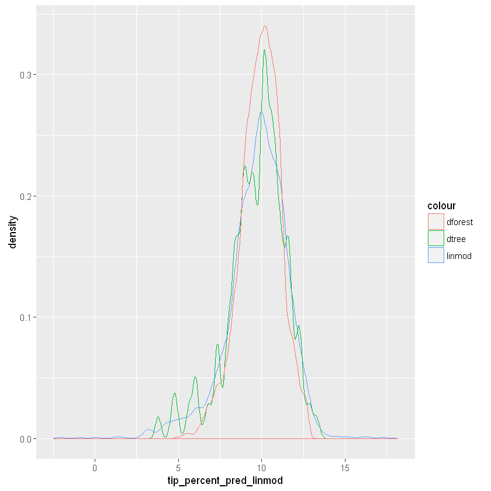


Both the linear model and the random forest give us smooth predictions. We can see that the random forest predictions are the most concentrated. The predictions for the decision tree follow a jagged distribution, probably as a result of overfitting, but we don't know that until we check preformance against the test set.

We now apply the model to the test data so we can compare the predictive power of each model. If we are correct about the decision tree overfitting, then we should see it preform poorly on the test data compared to the other two models. If we believe the random forest captures some inherent signals in the data that the linear model misses, we should see it perform better than the linear model on the test data.


```R
rxPredict(trained.models$linmod, data = mht_split$test, outData = mht_split$test, predVarNames = "tip_percent_pred_linmod", overwrite = TRUE)
rxPredict(trained.models$dtree, data = mht_split$test, outData = mht_split$test, predVarNames = "tip_percent_pred_dtree", overwrite = TRUE)
rxPredict(trained.models$dforest, data = mht_split$test, outData = mht_split$test, predVarNames = "tip_percent_pred_dforest", overwrite = TRUE)

rxSummary(~ SSE_linmod + SSE_dtree + SSE_dforest, data = mht_split$test,
          transforms = list(SSE_linmod = (tip_percent - tip_percent_pred_linmod)^2,
                            SSE_dtree = (tip_percent - tip_percent_pred_dtree)^2,
                            SSE_dforest = (tip_percent - tip_percent_pred_dforest)^2))
```

    Rows Processed: 24003751 
    Rows Processed: 24003751 
    Rows Processed: 24003751 
    Rows Processed: 24003751 
    


    Call:
    rxSummary(formula = ~SSE_linmod + SSE_dtree + SSE_dforest, data = mht_split$test, 
        transforms = list(SSE_linmod = (tip_percent - tip_percent_pred_linmod)^2, 
            SSE_dtree = (tip_percent - tip_percent_pred_dtree)^2, 
            SSE_dforest = (tip_percent - tip_percent_pred_dforest)^2))
    
    Summary Statistics Results for: ~SSE_linmod + SSE_dtree + SSE_dforest
    Data: mht_split$test (RxXdfData Data Source)
    File name: C:\Data\NYC_taxi\output\split\train.split.train.xdf
    Number of valid observations: 24003751 
     
     Name        Mean     StdDev   Min                    Max      ValidObs MissingObs
     SSE_linmod  82.97691 109.4821 0.00000000000248315989 8786.950 24003751 0         
     SSE_dtree   82.73915 109.5350 0.00000587611335319103 8898.893 24003751 0         
     SSE_dforest 82.83703 108.1598 0.00000000000003121173 8643.967 24003751 0         


All models did surprisingly well. This could be an indication that we still have a lot of left-over signal to capture, i.e. the model is **underfitting**. This makes sense, given that there are still a lot of important columns in the data that we left out of the models, such as `payment_type` which has a strong influence on `tip_percent`. We can use RMSE (the square root of the numbers under the `Mean` column above) to compare the models with each other, we don't know how well they do predicting in the first place. So let's also look at the correlation between `tip_percent` and each of the models' predictions.


```R
rxc <- rxCor( ~ tip_percent + tip_percent_pred_linmod + tip_percent_pred_dtree + tip_percent_pred_dforest, data = mht_split$test)
print(rxc)
```

    Rows Processed: 24003751 
                             tip_percent tip_percent_pred_linmod tip_percent_pred_dtree tip_percent_pred_dforest
    tip_percent                1.0000000               0.1402579              0.1499408                0.1494418
    tip_percent_pred_linmod    0.1402579               1.0000000              0.8645227                0.9089591
    tip_percent_pred_dtree     0.1499408               0.8645227              1.0000000                0.9321950
    tip_percent_pred_dforest   0.1494418               0.9089591              0.9321950                1.0000000
    

The correlation numbers are somewhat disappointing: as we can see the predictions from our model are not as well as expected. There can be different reasons our predictions are not very accurate, some apply across the board (such as having data that hasn't been properly cleaned, or leaving out important variables), and others are model-specific (for example, linear models can be sensetive to outliers while tree-based models are not). We examine such assumptions more thoroughly in our modeling course, as well as ways that we can improve our models, in another course.

## Conclusion

The modeling examples shown above are very basic and intended to showcase how the analytics algorithms work. For a more in-depth knowledge of how to build models, tune parameters, and test models using methods such as **cross validation**, we encourage you to take our *Modeling with MRS* course.

Throughout this course we learned how to use `RevoScaleR` and its capabilities to do big data analysis, and how to leverage R's functionality as offered in the `base` package or any third-party packages in `RevoScaleR`. See you next time.


```R

```
